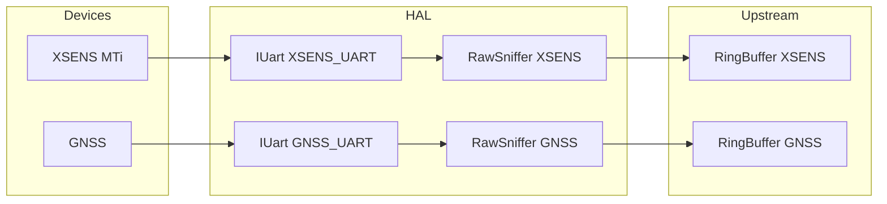
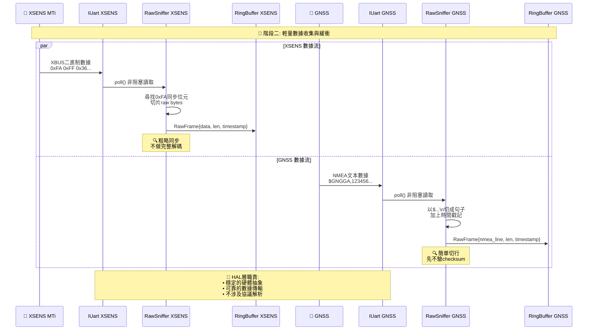
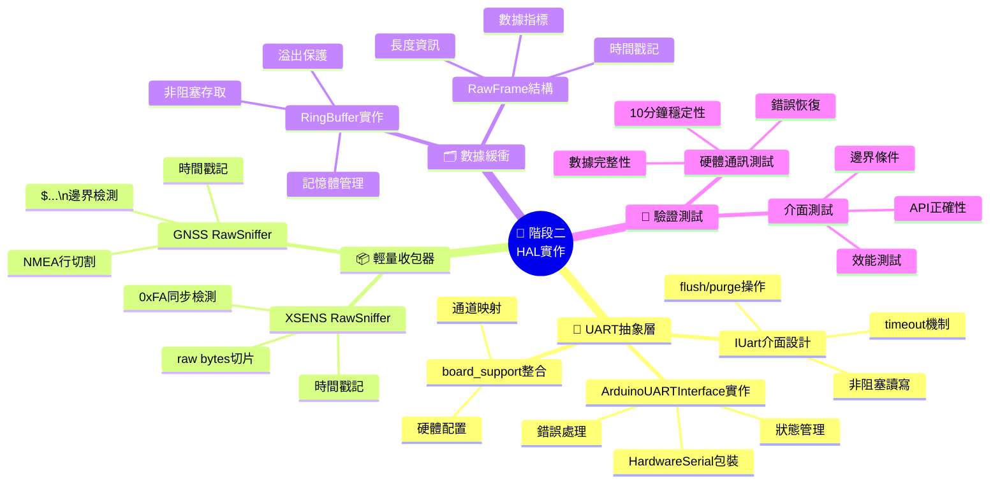

差不多，但重點要分清楚喔：  
**階段二（HAL）**的目標是把「實體 UART 埠」包成**穩定可替換的介面**，並驗證能穩定收/送資料。這一階段**可以開始接上 XSENS 與 GNSS、抓取原始位元流**，但**不做完整解析**（解析放後面模組/協議層）。

# 你現在應該做的事（HAL 觀點）

- 用 `IUart` 打開兩個埠：`XSENS_UART`、`GNSS_UART`（在 `board_support.h` 指派）。
    
- 實作/驗證：非阻塞讀寫、timeout、`flushTx()`、`purgeRx()`。
    
- 建立**輕量收包器**（sniffer），只做「切片與時間戳」：
    
    - GNSS：以 `$`…`\n` 切成 NMEA 行（先別驗 checksum）。
        
    - XSENS：抓連續 raw bytes，先以同步位元（例如常見的 `0xFA`）做**粗略**切界（不用解碼）。
        

# 流程（這階段）



# 小骨架（示意，先能跑）

```cpp
// xsens_link.h
struct RawFrame { const uint8_t* p; uint16_t len; uint64_t ts_us; };
using RxCallback = void(*)(const RawFrame&);

class XsensLink {
 public:
  XsensLink(IUart& u, RxCallback cb): u_(u), cb_(cb) {}
  void poll() {
    int n = u_.read(buf_+w_, sizeof(buf_)-w_);
    if (n <= 0) return;
    w_ += n; ts_ = board_micros();
    // 粗略同步：找 0xFA 作為可能的 frame 起點（先不解碼）
    int start = 0;
    while (start < w_ && buf_[start] != 0xFA) ++start;
    if (start > 0) { memmove(buf_, buf_+start, w_-start); w_ -= start; }
    // 閾值到達就吐 raw chunk 給上層（避免塞爆）
    if (w_ >= 64) { RawFrame f{buf_, (uint16_t)w_, ts_}; cb_(f); w_ = 0; }
  }
 private:
  IUart& u_; RxCallback cb_;
  uint8_t buf_[256]; int w_ = 0; uint64_t ts_ = 0;
};

// gnss_link.h（收 NMEA 行）
class GnssLink {
 public:
  GnssLink(IUart& u, RxCallback cb): u_(u), cb_(cb) {}
  void poll() {
    uint8_t b;
    while (u_.read(&b,1) == 1) {
      if (b == '\n') { RawFrame f{line_, (uint16_t)len_, board_micros()}; cb_(f); len_ = 0; }
      else if (len_ < sizeof(line_)) line_[len_++] = b;
    }
  }
 private:
  IUart& u_; RxCallback cb_;
  uint8_t line_[128]; uint16_t len_ = 0;
};
```


---

# `src/comm/uart_interface.h/.cpp` 規格說明（HAL：UART 抽象層）

## 🎯 用途（What & Why）

把所有 **硬體 UART 的操作**（初始化/讀寫/逾時/flush）**抽象成統一介面**，讓上層（GNSS/IMU 解析、Protocol、Transport）不需直接碰 `SerialX` 或板子差異。  
之後若更換通道（Serial1→Serial3）、更換連線方式（UART→USB/UDP/模擬器），**上層程式碼不需修改**。

---

## 🧭 分層定位（責任邊界）

- **這層要做**：
    
    1. 開關 UART、設定鮑率與逾時
        
    2. 非阻塞/阻塞讀寫（單位元組、批次）
        
    3. TX flush、基本「是否初始化」狀態回報
        
- **這層不做**：  
    ✗ NMEA/二進制幀解析（交給 Parser/Router）  
    ✗ 通道對應（哪個裝置→哪個 Serial）（放在 `board_support.h`）  
    ✗ 協議打包（放在 Protocol 層）
    

---

## 🧩 介面總覽（你已提供的 .h）

```cpp
class UARTInterface {
public:
    virtual ~UARTInterface() = default;
    virtual bool   initialize(uint32_t baud_rate) = 0;  // 開啟UART
    virtual void   shutdown() = 0;                      // 關閉UART
    virtual size_t available() const = 0;               // 可讀位元組數（非阻塞）
    virtual int    read() = 0;                          // 讀1 byte；無資料回 -1
    virtual size_t read(uint8_t* buf, size_t len) = 0;  // 讀多byte；受timeout影響
    virtual size_t write(uint8_t data) = 0;             // 寫1 byte
    virtual size_t write(const uint8_t* buf, size_t len) = 0; // 寫多byte
    virtual void   flush() = 0;                         // 刷TX（確保送出）
    virtual bool   isConnected() const = 0;             // 回報連線/可用狀態
    virtual void   setTimeout(uint32_t timeout_ms) = 0; // 讀取逾時(ms)
    virtual uint32_t getTimeout() const = 0;
protected:
    uint32_t baud_rate_;
    uint32_t timeout_ms_;
    bool     is_initialized_;
};

class ArduinoUARTInterface : public UARTInterface {
public:
    explicit ArduinoUARTInterface(int serial_port);  // 建議未來改吃 Channel enum
    // 其餘見你提供的 .h
};
```

---

## 📐 行為/語意規定（請在 .cpp 落實）

### 初始化/關閉

- `initialize(baud)`：
    
    - 呼叫對應 `HardwareSerial.begin(baud)`；清空 RX 殘留；`is_initialized_ = true`；記錄 `baud_rate_`。
        
    - 連續呼叫應 **冪等**（已初始化則直接回 `true`）。
        
- `shutdown()`：
    
    - 若已初始化則呼叫 `end()`；`is_initialized_ = false`。
        

### 讀取

- `available()`：回傳 **目前 RX 可讀位元組數**（非阻塞）。
    
- `read()`：
    
    - 若 `available()==0` 回 `-1`（非阻塞語意）。
        
    - 若有資料，回 0–255 的位元組值（int）。
        
- `read(buf,len)`：
    
    - 使用 Arduino 的 `readBytes()` 或等價函式，受 `timeout_ms_` 影響；回 **實際讀到的位元組數**。
        
    - 若 `len==0` 或未初始化，回 0。
        

### 寫入/Flush

- `write(byte)` / `write(buf,len)`：
    
    - 直通 `HardwareSerial.write()`；回寫入數（理論上等於 `len`）。
        
- `flush()`：
    
    - 直通 `HardwareSerial.flush()`，**語意＝等待 TX 緩衝送完**。
        

### 狀態/逾時

- `isConnected()`：無標準硬體連線檢測時，**回 `is_initialized_`** 即可（留 TODO：未來可加入活動心跳/錯誤計數）。
    
- `setTimeout(ms)`/`getTimeout()`：
    
    - 設定並轉呼叫 `HardwareSerial.setTimeout(ms)`（若已初始化）。
        

### 例外/安全

- 所有 API 遇未初始化（`!is_initialized_`）**不得崩潰**：
    
    - 讀取回 -1/0、寫入回 0、flush 不動作、狀態回 false。
        
- **不可在 ISR 中呼叫**（由更上層保證）。
    

---

## 🔗 整合點（其他模組如何使用）

- **通道對應**：在 `board_support.h` 內把 _裝置→Serial_ 的映射集中管理（例如 `GNSS→Serial3`、`IMU→Serial2`）。
    
- **工廠/建構**（建議）：
    
    - 提供 `make_uart_gnss()`、`make_uart_mti()`…，由工廠負責把「通道 enum / Serial 索引」灌給 `ArduinoUARTInterface`。
        
    - 之後改口，只改 `board_support.h`/工廠即可，上層免改。
        

---

## 🧪 驗收條件（Acceptance Criteria）

- 初始化後可連續 `available()/read()` 拿到 NMEA/IMU 原始 bytes，長跑 ≥10 分鐘無阻塞。
    
- 更改鮑率（115200→460800）後仍可穩定收發。
    
- 將 GNSS 通道從 SerialX 改成 SerialY：**只需修改 `board_support.h`/工廠**，Parser/Protocol 無需改動。
    
- `read()` 在無資料時必定回 `-1`（非阻塞保證）；`read(buf,len)` 受 `timeout_ms_` 控制。
    

---

## 🧱 `.cpp` 最小骨架（Claude 可直接依此填充）

```cpp
// src/comm/uart_interface_arduino.cpp
#include "src/comm/uart_interface.h"
#include "src/hal/board_support.h"   // TODO: 提供 getUARTSerial(...) 或索引查表
#include <Arduino.h>

ArduinoUARTInterface::ArduinoUARTInterface(int serial_port)
: serial_port_(serial_port), serial_instance_(nullptr) {
  baud_rate_ = 0;
  timeout_ms_ = 0;
  is_initialized_ = false;
}

ArduinoUARTInterface::~ArduinoUARTInterface() { shutdown(); }

// 取得對應的 HardwareSerial 實例；請在此接上你的 board_support
void* ArduinoUARTInterface::getSerialInstance() {
  // TODO 方案A：若你有 getUARTSerialByIndex(int)：
  //   return static_cast<void*>(&getUARTSerialByIndex(serial_port_));
  // TODO 方案B：若你有 enum Channel → Serial 的函式，則把 serial_port_ 當作 key 去轉
  return nullptr; // 先回 nullptr，請 Claude 依你專案補上
}

bool ArduinoUARTInterface::initialize(uint32_t baud_rate) {
  if (is_initialized_) return true;
  serial_instance_ = getSerialInstance();
  if (!serial_instance_) return false;

  HardwareSerial* s = static_cast<HardwareSerial*>(serial_instance_);
  s->begin(baud_rate);
  s->setTimeout(timeout_ms_);
  // 清 RX 殘留，避免半句 NMEA 影響
  while (s->available()) (void)s->read();
  s->flush();

  baud_rate_ = baud_rate;
  is_initialized_ = true;
  return true;
}

void ArduinoUARTInterface::shutdown() {
  if (!is_initialized_) return;
  if (auto* s = static_cast<HardwareSerial*>(serial_instance_)) {
    s->flush();
    s->end();
  }
  is_initialized_ = false;
}

size_t ArduinoUARTInterface::available() const {
  if (!is_initialized_) return 0;
  auto* s = static_cast<HardwareSerial*>(serial_instance_);
  return s->available();
}

int ArduinoUARTInterface::read() {
  if (!is_initialized_) return -1;
  auto* s = static_cast<HardwareSerial*>(serial_instance_);
  if (!s->available()) return -1;
  return s->read(); // 0–255
}

size_t ArduinoUARTInterface::read(uint8_t* buffer, size_t length) {
  if (!is_initialized_ || !buffer || !length) return 0;
  auto* s = static_cast<HardwareSerial*>(serial_instance_);
  return s->readBytes(buffer, length); // 受 timeout_ms_ 影響
}

size_t ArduinoUARTInterface::write(uint8_t data) {
  if (!is_initialized_) return 0;
  auto* s = static_cast<HardwareSerial*>(serial_instance_);
  return s->write(data);
}

size_t ArduinoUARTInterface::write(const uint8_t* buffer, size_t length) {
  if (!is_initialized_ || !buffer || !length) return 0;
  auto* s = static_cast<HardwareSerial*>(serial_instance_);
  return s->write(buffer, length);
}

void ArduinoUARTInterface::flush() {
  if (!is_initialized_) return;
  auto* s = static_cast<HardwareSerial*>(serial_instance_);
  s->flush();
}

bool ArduinoUARTInterface::isConnected() const {
  // Arduino 無標準連線狀態；暫用初始化狀態。
  return is_initialized_;
}

void ArduinoUARTInterface::setTimeout(uint32_t timeout_ms) {
  timeout_ms_ = timeout_ms;
  if (!is_initialized_) return;
  auto* s = static_cast<HardwareSerial*>(serial_instance_);
  s->setTimeout(timeout_ms_);
}

uint32_t ArduinoUARTInterface::getTimeout() const { return timeout_ms_; }
```

---

## 🧭 使用示例（上層如何用）

```cpp
#include "src/comm/uart_interface.h"

// 例：GNSS UART
ArduinoUARTInterface gnss(/* 由工廠或 board_support 提供的Serial索引 */);
void setup() {
  gnss.setTimeout(20);
  gnss.initialize(115200);
}
void loop() {
  while (gnss.available()) {
    int c = gnss.read();
    if (c < 0) break;
    // 丟給 NMEA assembler/parser
  }
}
```

## ✅ 後續建議（可選強化）

- 將建構子參數改為 `hal::UARTChannel`（enum），並在 `board_support.h` 提供 `HardwareSerial& getUARTSerial(hal::UARTChannel)`，以完全切斷上層對 Serial 編號的依賴。
    
- 新增 `UARTInterfaceMock`（記憶體迴圈緩衝）以支援單元測試。
    

---

把以上交給 Claude Code，它就能在你的現有 `.h` 基礎上，正確完成 `.cpp`，並跟 `board_support.h` 接起來。

## 圖解釋二階段內容

### 🎯 階段二 HAL 層實作架構圖

```mermaid
graph TB
    subgraph "🎯 階段二目標: HAL層建構與驗證"
        GOAL["建立穩定可替換的UART介面<br/>驗證硬體通訊穩定性<br/>為後續協議層奠定基礎"]
    end

    subgraph "📡 感測器設備 (外部硬體)"
        XSENS["🧭 XSENS MTi<br/>IMU感測器<br/>輸出: XBUS二進制數據<br/>同步位元: 0xFA"]
        GPS_DEV["📍 LOCOSYS GPS<br/>GNSS接收器<br/>輸出: NMEA文本數據<br/>句子格式: $...\\n"]
    end

    subgraph "🔧 HAL層核心 (本階段重點)"
        style HAL_CORE fill:#e1f5fe,stroke:#1976d2,stroke-width:4px
        
        subgraph "UART抽象介面"
            IUART["IUart介面<br/>📋 核心API:<br/>• 非阻塞讀寫<br/>• timeout控制<br/>• flushTx()<br/>• purgeRx()"]
            UART_XSENS["IUart XSENS_UART<br/>Serial2 (115200)<br/>SERCOM2"]
            UART_GNSS["IUart GNSS_UART<br/>Serial4 (115200)<br/>SERCOM3"]
        end
        
        subgraph "輕量收包器 (Raw Sniffer)"
            XSENS_SNIFFER["XSENS RawSniffer<br/>🔍 功能:<br/>• 尋找0xFA同步位元<br/>• 切片raw bytes<br/>• 時間戳記<br/>• 不做完整解碼"]
            GNSS_SNIFFER["GNSS RawSniffer<br/>🔍 功能:<br/>• 切成NMEA行($...\\n)<br/>• 時間戳記<br/>• 先不驗checksum"]
        end
    end

    subgraph "📦 數據緩衝 (Upstream)"
        XSENS_QUEUE["RingBuffer XSENS<br/>🗂️ 儲存原始封包<br/>等待後續解析"]
        GNSS_QUEUE["RingBuffer GNSS<br/>🗂️ 儲存NMEA句子<br/>等待後續解析"]
    end

    subgraph "⚙️ 硬體配置層"
        BOARD_SUP["board_support.h/.cpp<br/>🛠️ 通道映射管理<br/>UARTChannel → Serial"]
    end

    %% 數據流向
    XSENS --> UART_XSENS
    GPS_DEV --> UART_GNSS
    
    UART_XSENS --> IUART
    UART_GNSS --> IUART
    
    IUART --> XSENS_SNIFFER
    IUART --> GNSS_SNIFFER
    
    XSENS_SNIFFER --> XSENS_QUEUE
    GNSS_SNIFFER --> GNSS_QUEUE
    
    IUART --> BOARD_SUP

    %% 樣式
    classDef hal fill:#e3f2fd,stroke:#1976d2,stroke-width:3px
    classDef device fill:#fff3e0,stroke:#f57c00,stroke-width:2px
    classDef buffer fill:#f3e5f5,stroke:#7b1fa2,stroke-width:2px
    classDef config fill:#e8f5e8,stroke:#388e3c,stroke-width:2px

    class IUART,UART_XSENS,UART_GNSS,XSENS_SNIFFER,GNSS_SNIFFER hal
    class XSENS,GPS_DEV device  
    class XSENS_QUEUE,GNSS_QUEUE buffer
    class BOARD_SUP config
```

### 🔄 階段二數據處理流程



### 🏗️ 階段二實作重點



### ✅ 階段二驗收標準

```mermaid
graph LR
    subgraph "🎯 功能驗收"
        F1["✅ UART初始化成功<br/>所有通道正常開啟"]
        F2["✅ 數據收集穩定<br/>XSENS+GNSS同時運行"]
        F3["✅ 非阻塞操作<br/>無主迴圈阻塞"]
        F4["✅ 時間戳記正確<br/>微秒級精度"]
    end
    
    subgraph "⏱️ 效能驗收"  
        P1["✅ 長期穩定性<br/>≥10分鐘無問題"]
        P2["✅ 數據完整性<br/>無封包遺失"]
        P3["✅ 記憶體管理<br/>無洩漏/溢出"]
        P4["✅ CPU負載合理<br/>≤20%使用率"]
    end
    
    subgraph "🔧 整合驗收"
        I1["✅ 硬體抽象完整<br/>上層無直接Serial操作"]
        I2["✅ 通道配置靈活<br/>可輕鬆更換埠"]
        I3["✅ 錯誤處理健全<br/>異常不影響系統"]
        I4["✅ 為協議層準備<br/>RawFrame格式標準"]
    end

    F1 --> F2 --> F3 --> F4
    P1 --> P2 --> P3 --> P4  
    I1 --> I2 --> I3 --> I4
    
    F4 --> P1
    P4 --> I1
```


