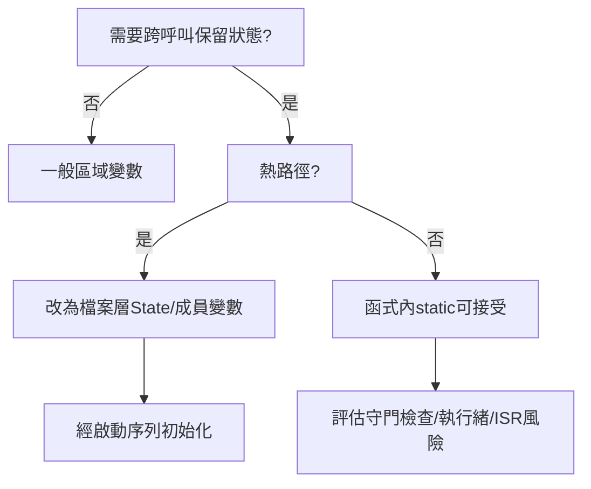

# static變數與全域變數死機分析報告

> **文件版本**: 1.0  
> **建立日期**: 2025-08-22  
> **專案**: GMINS 系統穩定性分析  
> **分析範圍**: aa4ca7c → b3a0829 之間的死機原因

## 🚨 執行摘要

透過對比 aa4ca7c (穩定) 與 b3a0829 (死機) 版本，發現 commit 53442ca 中的 IMU adapter 修改是主要死機根因。問題核心是：**函式內static的守門檢查 + 高頻LOG調用 + 自製millis()熱路徑調用**，而非記憶體洩漏或碎片化。

---

## ✅ 快速結論

### **正確的分析**
- ✅ **初始化順序風險** - 跨翻譯單元的static物件初始化順序未定義
- ✅ **函式內static的守門開銷** - C++ magic static 在高頻調用中成為熱點
- ✅ **高頻LOG/millis()放大風險** - 錯誤路徑的過度診斷輸出
- ✅ **MCU RAM限制** - 需節制狀態常駐記憶體使用

### **需要修正的認知**
- ❌ **「static造成記憶體碎片化」** → 碎片化是heap/new/malloc的問題；static只佔用固定區段
- ❌ **「chrono會記憶體洩漏」** → `time_point`是輕量POD；問題在函式內static守門檢查
- ❌ **「建構子失敗=未定義行為」** → MCU編譯鏈多數禁用例外；真正風險是複雜建構+初始化時機

---

## 🔍 死機根因分析

### **commit 53442ca 的問題代碼**

```cpp
// src/adapter/imu_adapter.h - 每個函數都有多個static！
inline mu::Vector3f getAccelerationVector(const IMUData& imu_data) {
    static mu::Vector3f last_valid_accel(0.0f, 0.0f, -9.81f);  // 🚨 函式內static
    static bool first_call = true;                              // 🚨 函式內static
    static uint32_t last_warn_time = 0;                         // 🚨 函式內static + 高頻millis()
    
    uint32_t now = millis();  // 🚨 每次無效數據都調用自製millis()
    if (now - last_warn_time >= 1000) {
        LOGW("IMU_ADAPTER", "⚠️ 加速度數據無效，使用上次有效值防止Valley");  // 🚨 高頻LOG
    }
}

// 自製millis()實現
inline uint32_t millis() {
    static auto start = std::chrono::steady_clock::now();  // 🚨 又一個函式內static！
    auto now = std::chrono::steady_clock::now();
    return std::chrono::duration_cast<std::chrono::milliseconds>(now - start).count();
}
```

### **🎯 真正的死機機制**

| 風險因子 | 問題描述 | 影響 |
|---------|---------|------|
| **C++ Magic Static 守門** | 每個函式內static都有執行緒安全檢查 | 高頻調用時CPU開銷 |
| **熱路徑millis()調用** | 每次IMU數據無效都觸發時間計算 | chrono對象計算負擔 |
| **高頻LOG調用** | 錯誤路徑每秒觸發LOGW | printf格式化+串口阻塞 |
| **初始化時機問題** | static初始化可能在系統未準備好時發生 | 未定義行為風險 |

---

## 🛠️ 安全落地方案

### **1. 時基集中管理（避免函式內static守門）**

```cpp
// time_base.cpp - 檔案層static，一次性初始化
namespace hal {
    static const auto kT0 = std::chrono::steady_clock::now(); // 啟動期完成一次
    
    uint32_t millis() {
        using namespace std::chrono;
        return static_cast<uint32_t>(
            duration_cast<milliseconds>(steady_clock::now() - kT0).count()
        );
    }
}
```

### **2. IMU狀態結構化管理**

```cpp
// imu_adapter.cpp - 單一狀態結構，避免多個函式內static
namespace {
    struct IMUState {
        mu::Vector3f last_acc{0.0f, 0.0f, -9.81f};
        mu::Vector3f last_gyr{0.0f, 0.0f,  0.0f};
        uint32_t     last_warn{0};
        bool         seen_valid{false};
    };
    IMUState st; // 單一守門，無函式內static
}

inline bool should_log(uint32_t now, uint32_t& last, uint32_t interval_ms) {
    if (now - last >= interval_ms) { 
        last = now; 
        return true; 
    }
    return false;
}

void IMUAdapter::process(const RawIMU& in, IMUData& out) {
    const uint32_t now = hal::millis();

    if (!isValid(in)) {
        out.accel = st.last_acc;
        out.gyro  = st.last_gyr;
        // 限流至5秒，減少LOG壓力
        if (should_log(now, st.last_warn, 5000)) { 
            LOGW("IMU_ADAPTER","Accel invalid; hold"); 
        }
        return;
    }
    st.seen_valid = true;
    st.last_acc   = out.accel = in.accel;
    st.last_gyr   = out.gyro  = in.gyro;
}
```

### **3. 初始化順序治理**

```cpp
// 系統啟動序列 - 避免跨檔案依賴
void system_startup() {
    init_logging();      // 1. 建立日誌系統
    init_timebase();     // 2. 建立時間基準
    init_hal();          // 3. 初始化硬體抽象層
    init_protocols();    // 4. 初始化協議層
    run();               // 5. 開始主循環
}

// 避免這種跨檔案static依賴
// ❌ static CommandHandler handler(&controller);
// ✅ 改為：
//    controller.init(); 
//    handler.bind(controller);
```

---

## 📊 風險評估表

| 項目 | 原認知 | 修正後認知 | 建議做法 |
|-----|-------|-----------|---------|
| **函式內static** | 容易導致死機 | **部分正確**：有C++ magic static守門檢查熱點風險 | 把狀態搬到檔案層State結構或物件成員 |
| **全域/檔案層static** | 初始化順序未定義 | **正確但需補充**：跨翻譯單元順序未定義；同檔案依宣告順序 | 避免跨檔案依賴；用啟動流程init() |
| **記憶體碎片化** | static會造成碎片 | **錯誤**：碎片來自heap；static是固定區，不碎片化 | 注意總量(.bss/.data)與堆疊空間 |
| **chrono/millis()** | 可能洩漏/很重 | **不正確**：time_point無洩漏；重點是函式內static起點 | kT0放檔案層const，millis()僅做差值轉型 |
| **LOG過載** | 每秒WARN危險 | **正確**：printf/格式化/emoji/串口阻塞造成壓力 | 限流(≥5s)、簡訊息、禁emoji、避免浮點格式化 |

---

## 🧪 驗證方法

### **壓力測試**
1. **1kHz壓測** `IMUAdapter::process()` 30秒 → 無崩潰、WARN每5s一次
2. **時間回繞測試** 設定 `st.last_warn = UINT32_MAX-100` → 確認限流仍正確
3. **LOG簡化測試** 關掉emoji/浮點格式化 → 串口阻塞明顯下降

### **記憶體監控**
```cpp
// 編譯時檢查static記憶體使用
static_assert(sizeof(IMUState) < 64, "IMUState too large");

// 運行時監控可用記憶體
#ifdef ESP32
void check_memory() {
    size_t free_heap = ESP.getFreeHeap();
    LOGI("Free heap: %zu bytes", free_heap);
}
#endif
```

---

## 🧭 Static使用決策流程



---

## 🎯 關鍵修復建議

### **立即行動**
1. **移除函式內static** - 整合到檔案層狀態結構
2. **限制LOG頻率** - 錯誤路徑限流至5秒以上
3. **簡化millis()** - 時間基準移至檔案層static const
4. **清理格式化** - 移除emoji、浮點格式化、過長字串

### **架構改善**
1. **系統啟動序列** - 明確的初始化順序
2. **狀態收斂** - 避免散亂的靜態變數
3. **錯誤處理** - 優雅降級而非頻繁警告

---

## 📝 結論

aa4ca7c → b3a0829 的死機問題主要來自於 **53442ca commit 中IMU adapter的函式內static濫用**，導致：

1. **C++ magic static守門檢查** 在高頻IMU處理中成為性能瓶頸
2. **自製millis()的chrono計算** 在熱路徑被頻繁調用
3. **高頻LOG輸出** 造成串口阻塞和格式化開銷
4. **初始化時機問題** 可能在系統未準備好時觸發

**解決方案是狀態收斂、時基前移、錯誤路徑限流，而非避免所有static使用**。正確使用的檔案層static是安全且必要的。