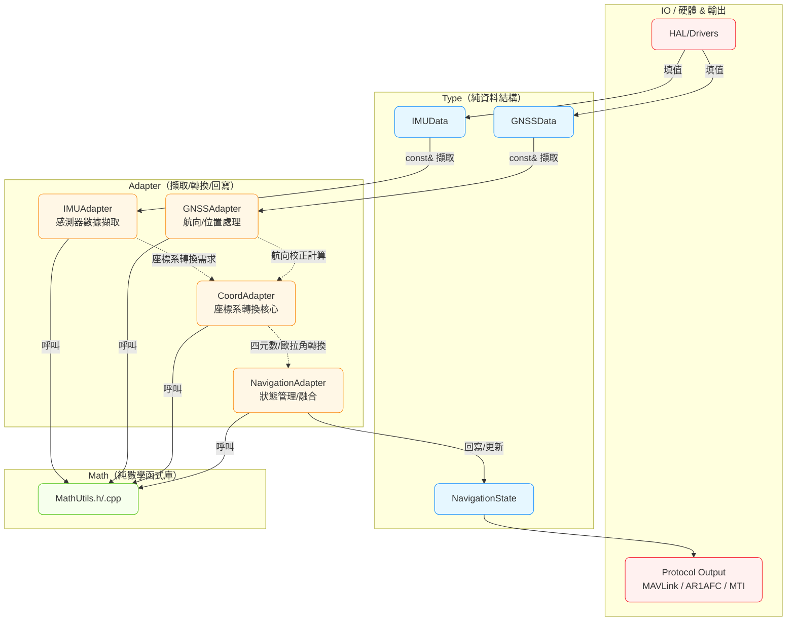
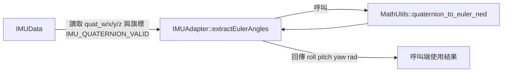
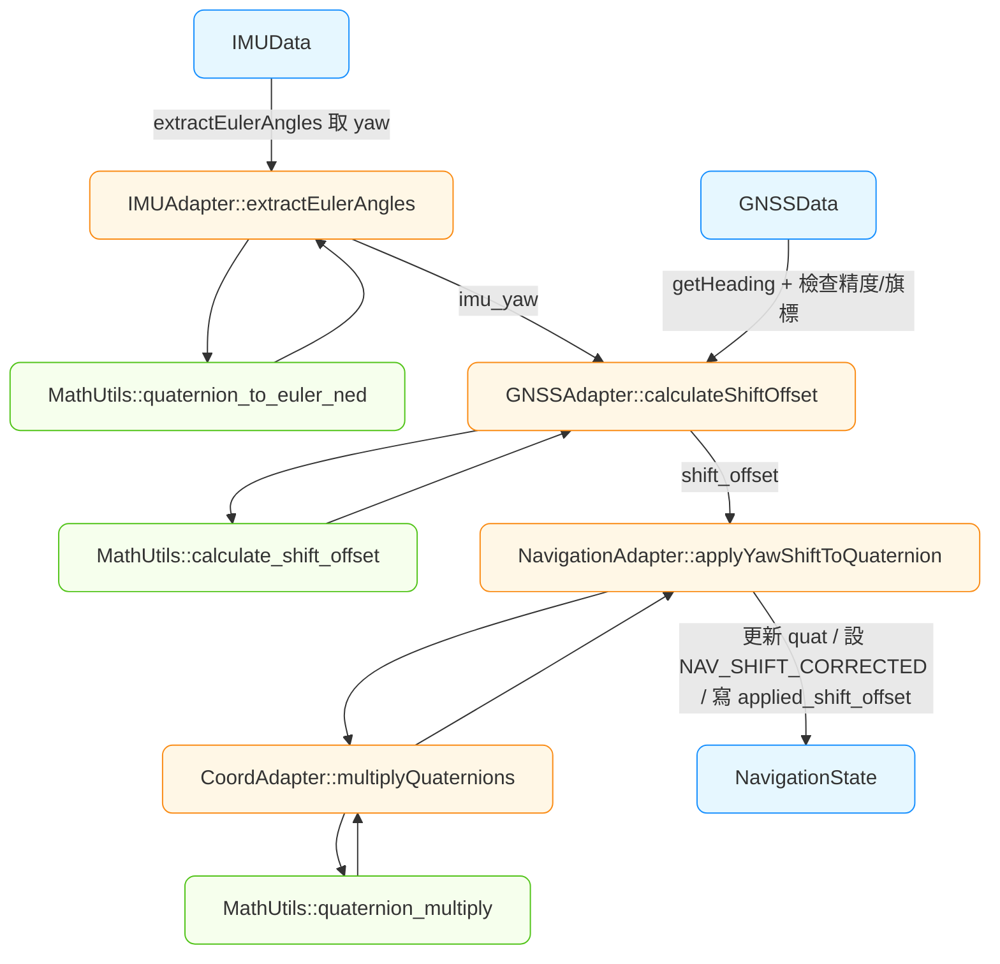
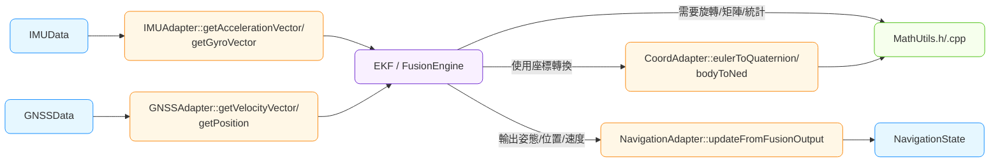

太可以！我幫你用「用途式」的方式畫幾張 Mermaid 流程圖，放進 Obsidian 就能直接看。重點把 **Type（data_types）→ Adapter → Math（math_utils）** 的資料流講清楚，並示範兩個最常用的場景。

---

# 總覽：資料如何在 Type / Adapter / Math 之間流動

- **Type**：只存資料（不做計算、不配記憶體）。
    
- **Adapter**：從 Type 抽欄位 → 呼叫 Math → 回傳或回寫（不做動態配置）。
    
- **Math**：純函式、吃/吐標準型別（float、陣列、Vector3f…）。
    

---

# 用途 1：從 IMU 四元數取得歐拉角（不改動 Type）

**關鍵點**

- Adapter 以 `const IMUData&` 擷取欄位，**不改 IMUData**。
    
- 回傳三個角（弧度）；是否轉成度數交由呼叫端（避免隱性單位轉換）。
    

---

# 用途 2：GNSS 航向 vs IMU Yaw → 計算 Shift，並應用到 NavigationState

**關鍵點**

- `GNSSAdapter::calculateShiftOffset()`：輸入 `GNSSData`（含旗標與精度門檻）+ `imu_yaw` → 回傳 `shift_offset`。
    
- `NavigationAdapter::applyYawShiftToQuaternion()`：使用 CoordAdapter 進行四元數乘法，就地更新 `NavigationState` 的四元數與旗標。

- `CoordAdapter::multiplyQuaternions()`：封裝 MathUtils 的四元數乘法，用於 Shift 校正應用。
    

---

# 用途 3（加碼）：Fusion 使用向量/矩陣（只讀 Type、重用 Math）

**關鍵點**

- Fusion 模組**只用** Adapter 提供的向量/矩陣入口，不直接碰 `IMUData` 欄位。
    
- 所有數學（矩陣逆、濾波、統計）統一走 `MathUtils`。
    

---

## 一句話總結

> **Type 管資料、Adapter 做擷取與回寫、Math 做計算。**  
> Adapter 永遠「讀 Type → 呼叫 Math → 回傳/寫回 Type」，不做動態記憶體配置。

---

## 📋 實際函數名稱對照表

### IMUAdapter 實際函數
- `extractEulerAngles()` - 從四元數提取歐拉角
- `extractQuaternion()` - 提取並驗證四元數
- `getAccelerationVector()` - 提取加速度向量 (Body frame)
- `getGyroVector()` - 提取角速度向量 (Body frame)
- `getMagnetometerVector()` - 提取磁力計向量 (Body frame)
- `getYawAngle()` - 提取偏航角（弧度）
- `isDataValid()` - 綜合數據有效性檢查

### GNSSAdapter 實際函數
- `getHeading()` - 提取航向角（弧度）
- `getHeadingDegrees()` - 提取航向角（度數）
- `calculateShiftOffset()` - 計算與 IMU 的 Shift 偏移
- `getPosition()` - 提取 WGS84 位置數據
- `getVelocityVector()` - 提取速度向量 (NED)
- `calculateDataQuality()` - 計算數據品質分數 (0-100)
- `isValidForShiftCalibration()` - 檢查是否適合 Shift 校正

### CoordAdapter 實際函數
- `eulerToQuaternion()` - 歐拉角 → 四元數 (NED系)
- `quaternionToEuler()` - 四元數 → 歐拉角 (NED系)
- `multiplyQuaternions()` - 四元數乘法
- `nedToEnu()` / `enuToNed()` - NED ↔ ENU 座標轉換
- `bodyToNed()` / `nedToBody()` - Body ↔ NED 座標轉換
- `calculateShiftOffset()` - 計算 GNSS-IMU Shift 偏移量
- `applyShiftCorrection()` - 應用 Shift 校正

### NavigationAdapter 實際函數
- `extractQuaternion()` - 提取導航狀態四元數
- `extractEulerAngles()` - 提取導航狀態歐拉角
- `updateQuaternion()` - 更新四元數狀態
- `applyYawShiftToQuaternion()` - 四元數模式 Shift 校正
- `applyYawShiftToEuler()` - 歐拉角模式 Shift 校正
- `updateFromFusionOutput()` - 從融合輸出更新狀態
- `updatePosition()` / `updateVelocity()` - 更新位置/速度狀態

---

## 🏗️ 架構檢查結果

✅ **完全符合預期的設計:**
- **分層清楚**: Type → Adapter → Math 三層架構完整
- **職責明確**: 每個 Adapter 都有特定用途和清晰邊界
- **無狀態設計**: 所有 Adapter 都是純函數，無內部狀態
- **統一介面**: 錯誤處理、參數傳遞、命名約定都一致
- **依賴正確**: Adapter 只依賴 data_types.h 和 math_utils.h

✅ **CoordAdapter 核心地位確立**:
- 提供所有座標系轉換的統一入口
- 封裝複雜的數學運算為語義化介面
- 支援其他 Adapter 的座標轉換需求

✅ **實際使用流程完整**:
- IMU 數據擷取 → 數學計算 → 狀態更新
- GNSS 校正 → Shift 計算 → 四元數修正
- 融合引擎 → 多源數據處理 → 統一輸出

這個架構設計完全符合預期，為 GMINS 系統提供了穩固的基礎！