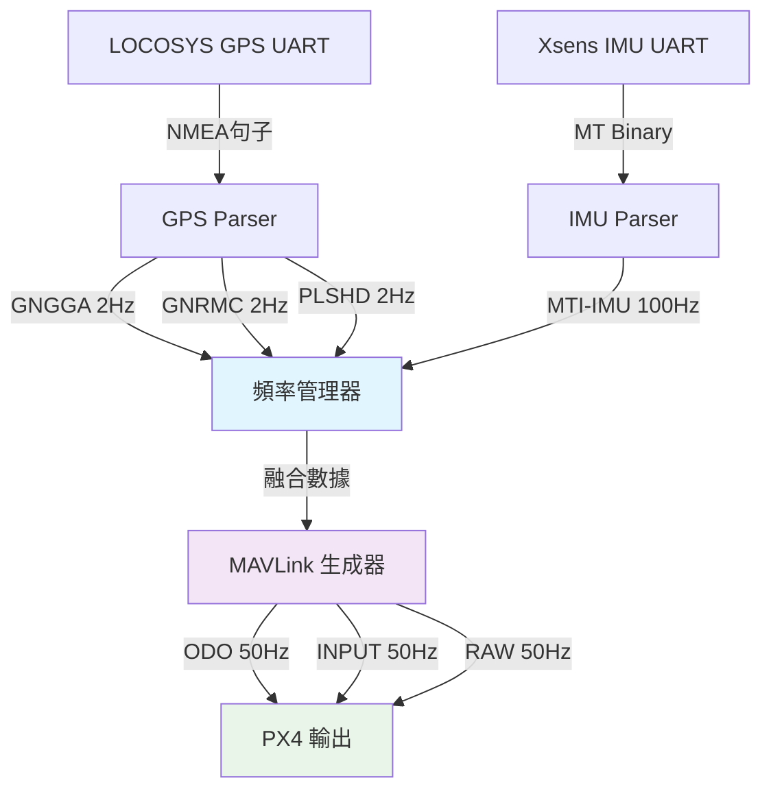
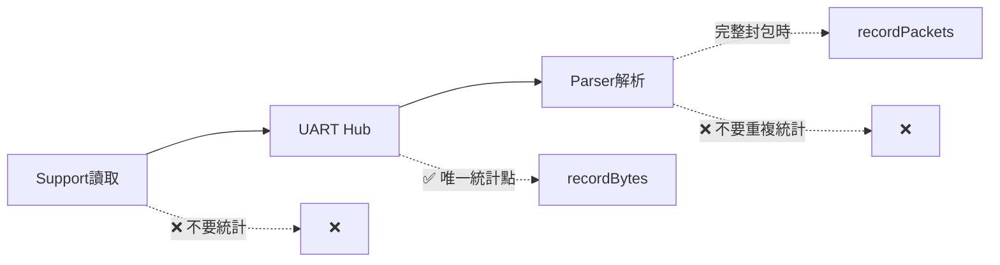

# 📦 DataFlowMonitor / MultiChannelMonitor 實戰用法

## 🎯 模組用途（一句話）

在**每個資料流程節點**精確量測：**Bytes/sec、packet Hz、operation Hz**，使用實際區間時間計算頻率，提供64位累積統計，支援多通道集中管理與詳細報告輸出。

---

## 🔌 快速上手（5 步驟）

### 1) 建立監控器（依通道）

使用工廠函式創建監控器（預設 5 秒一報）：

```cpp
#include "src/util/data_flow_monitor.h"

// 創建不同類型的監控器
monitor::DataFlowMonitor* mon_gnss = monitor::createUARTMonitor("GNSS");       // "UART-GNSS"
monitor::DataFlowMonitor* mon_imu = monitor::createSensorMonitor("IMU");       // "SENSOR-IMU"  
monitor::DataFlowMonitor* mon_mavlink = monitor::createProtocolMonitor("MAVLink"); // "PROTO-MAVLink"
```

### 2) 註冊到多通道監控管理器

```cpp
monitor::MultiChannelMonitor mcm;
mcm.registerMonitor(mon_gnss);
mcm.registerMonitor(mon_imu);
mcm.registerMonitor(mon_mavlink);
```

### 3) 在**資料源唯一入口**記帳 ⭐

**核心原則：統計唯一來源 - 只在 UART Hub 的 `push()` 記錄**

```cpp
// ✅ 正確做法：只在Hub層統計
size_t UARTHub::push(PortId port, const uint8_t* data, size_t len) {
    // 1. 寫入ring buffer
    size_t written = ring_[port].write(data, len);
    
    // 2. ⭐ 唯一統計點：記錄實際寫入的字節數
    if (monitors_[port]) {
        monitors_[port]->recordBytes(written);    // 實際寫入字節
        monitors_[port]->recordOperations(1);     // 一次推送操作
    }
    
    return written;
}
```

```

### 4) 在**組包完成**時記封包數

```cpp
// GNSS Parser 解析完整NMEA句子
if (nmea_parser.processLine(line)) {
    mon_gnss->recordPackets(1);   // 完整NMEA句子 +1
}

// IMU Parser 解析完整XSENS封包  
if (xsens_detector.isPacketComplete()) {
    mon_imu->recordPackets(1);    // 完整XSENS封包 +1
}
```

### 5) 在主迴圈統一出報

```cpp
void loop() {
    // 處理所有數據...
    
    // 最後統一檢查報告（每5秒自動輸出）
    mcm.updateAll();
}
```

---

## 🎖️ 輸出範例與內容詳解

### 📊 HAL UART 通道監控報告（實際輸出）

```
[I][BOARD_HAL] 🔄 ===== 感測器狀態報告 =====
[I][BOARD_HAL] 🔌 ===== HAL UART 通道監控報告 =====
[I][BOARD_HAL]   📡 [0] USB Debug:
[I][BOARD_HAL]     📊 字節頻率: 0.00 Bytes/sec
[I][BOARD_HAL]     📦 封包頻率: 0.00 Hz
[I][BOARD_HAL]     ⚙️ 操作頻率: 0.00 Hz
[I][BOARD_HAL]     📈 累積: 0 bytes, 0 packets
[I][BOARD_HAL]     🔄 狀態: Active
[I][BOARD_HAL]   📡 [1] LOCOSYS GPS Input:
[I][BOARD_HAL]     📊 字節頻率: 607.03 Bytes/sec
[I][BOARD_HAL]     📦 封包頻率: 0.00 Hz
[I][BOARD_HAL]     ⚙️ 操作頻率: 0.00 Hz
[I][BOARD_HAL]     📈 累積: 5636 bytes, 0 packets
[I][BOARD_HAL]     🔄 狀態: Active
[I][BOARD_HAL]   📡 [2] Xsens IMU Input:
[I][BOARD_HAL]     📊 字節頻率: 9102.24 Bytes/sec
[I][BOARD_HAL]     📦 封包頻率: 0.00 Hz
[I][BOARD_HAL]     ⚙️ 操作頻率: 0.00 Hz
[I][BOARD_HAL]     📈 累積: 81466 bytes, 0 packets
[I][BOARD_HAL]     🔄 狀態: Active
[I][BOARD_HAL]   📡 [3] Pixhawk PX4 Output:
[I][BOARD_HAL]     📊 字節頻率: 0.00 Bytes/sec
[I][BOARD_HAL]     📦 封包頻率: 0.00 Hz
[I][BOARD_HAL]     ⚙️ 操作頻率: 0.00 Hz
[I][BOARD_HAL]     📈 累積: 0 bytes, 0 packets
[I][BOARD_HAL]     🔄 狀態: Active
[I][BOARD_HAL]   📡 [4] NMEA Output:
[I][BOARD_HAL]     📊 字節頻率: 0.00 Bytes/sec
[I][BOARD_HAL]     📦 封包頻率: 0.00 Hz
[I][BOARD_HAL]     ⚙️ 操作頻率: 0.00 Hz
[I][BOARD_HAL]     📈 累積: 0 bytes, 0 packets
[I][BOARD_HAL]     🔄 狀態: Active
[I][BOARD_HAL] =====================================
```

### 📈 GMINS 頻率分析報告（實際輸出）

```
[I][FREQ_MGR] 🎯 ===== GMINS 頻率分析報告 =====
[I][FREQ_MGR] 📡 感測器輸入頻率:
[I][FREQ_MGR]   🧭 MTI-IMU:     99.86 Hz (目標: 100.0 Hz)
[I][FREQ_MGR]   📍 GNSS-GNGGA:  2.00 Hz
[I][FREQ_MGR]   📍 GNSS-GNRMC:  2.00 Hz
[I][FREQ_MGR]   📍 GNSS-PLSHD:  2.00 Hz
[I][FREQ_MGR]   📍 GNSS 總計:   5.99 Hz (目標: 6.0 Hz)
[I][FREQ_MGR] 📤 MAVLink 輸出頻率:
[I][FREQ_MGR]   🚀 ODO:         0.00 Hz
[I][FREQ_MGR]   🚀 INPUT:       0.00 Hz
[I][FREQ_MGR]   🚀 RAW:         0.00 Hz
[I][FREQ_MGR]   🚀 MAVLink 總計: 0.00 Hz (目標: 50.0 Hz)
[I][FREQ_MGR] 📦 自定義封包頻率:
[I][FREQ_MGR]   🔄 Fusion:      0.00 Hz
[I][FREQ_MGR]   📊 Status:      0.00 Hz
[I][FREQ_MGR]   🔧 Debug:       0.00 Hz
[I][FREQ_MGR]   📦 Custom 總計:  0.00 Hz (目標: 20.0 Hz)
[I][FREQ_MGR] 🎯 目標達成: ❌ 未達成
```

### 🔍 監控系統輸出內容詳細解析

#### 📊 HAL UART 通道監控 - 數據流量層面

| 項目 | 說明 | 正常範圍 | 異常指標 |
|------|------|----------|----------|
| **字節頻率 (Bytes/sec)** | UART 實際數據傳輸速率 | GPS: 400-800, IMU: 8000-12000 | 0 或超出範圍 |
| **封包頻率 (Hz)** | 完整封包解析完成頻率 | GPS: 5-10, IMU: 50-200 | 長時間為 0 |
| **操作頻率 (Hz)** | UART 讀寫操作執行頻率 | 與數據源相關 | 頻繁但無數據 |
| **累積統計** | 總字節數和封包數 | 持續增長 | 停止增長 |
| **狀態 (Active/Inactive)** | 通道啟用狀態 | Active | Inactive |

#### 📈 GMINS 頻率分析 - 應用層面

| 項目 | 說明 | 目標頻率 | 實際意義 |
|------|------|----------|----------|
| **MTI-IMU** | Xsens IMU 姿態數據 | 100.0 Hz | 姿態融合基準頻率 |
| **GNSS-GNGGA** | GPS 定位數據句子 | 2.0 Hz | 位置信息更新頻率 |
| **GNSS-GNRMC** | GPS 航行數據句子 | 2.0 Hz | 速度方向信息 |
| **GNSS-PLSHD** | GPS 航向數據句子 | 2.0 Hz | 真北航向信息 |
| **MAVLink ODO** | 里程計數據輸出 | 50.0 Hz | PX4 融合輸入 |
| **MAVLink INPUT** | GPS 輸入數據 | 50.0 Hz | PX4 GPS 數據 |
| **MAVLink RAW** | 原始 IMU 數據 | 50.0 Hz | PX4 IMU 數據 |
| **目標達成狀態** | 整體系統性能指標 | ✅ 達成 | 系統健康度 |

---

## 📋 輸入數據類型與輸出映射完整對照

### 🔌 UART 通道映射表

| 通道ID | 通道名稱 | 輸入數據類型 | 預期字節率 | 輸出監控項目 |
|--------|----------|--------------|------------|--------------|
| **[0]** | USB Debug | 調試信息 | 0-1000 Bytes/sec | 字節頻率、操作頻率 |
| **[1]** | LOCOSYS GPS Input | NMEA 0183 句子 | 400-800 Bytes/sec | 字節頻率、NMEA封包頻率 |
| **[2]** | Xsens IMU Input | XSENS MT Binary | 8000-12000 Bytes/sec | 字節頻率、MT封包頻率 |
| **[3]** | Pixhawk PX4 Output | MAVLink v2 | 2000-5000 Bytes/sec | 字節頻率、MAVLink封包頻率 |
| **[4]** | NMEA Output | NMEA 0183 句子 | 100-500 Bytes/sec | 字節頻率、NMEA輸出頻率 |

### 📊 感測器數據流向分析



### 🎯 數據處理管道對照

| 階段 | DataFlowMonitor 記錄 | FrequencyManager 記錄 | 用途說明 |
|------|---------------------|---------------------|----------|
| **UART輸入** | ✅ recordBytes() | ❌ | 原始數據流量監控 |
| **封包解析** | ✅ recordPackets() | ❌ | 完整封包統計 |
| **數據融合** | ❌ | ✅ trackSensorData() | 應用層頻率監控 |
| **MAVLink輸出** | ✅ recordBytes() | ✅ trackMAVLinkOutput() | 雙重監控確保準確 |

---

## 🔧 進階操作與配置

### ⚙️ 自訂報告間隔

```cpp
mon_gnss->setReportInterval(3000);  // 改為3秒一報
mon_imu->setReportInterval(10000);  // 改為10秒一報
```

### 🎛️ 動態啟用/停用

```cpp
mon_gnss->setEnabled(false);        // 暫停GNSS監控
// ... 執行某些操作 ...
mon_gnss->setEnabled(true);         // 恢復GNSS監控

if (mon_imu->isEnabled()) {
    // 監控啟用時的邏輯
}
```

### 📊 取得即時統計

```cpp
monitor::DataFlowStats stats = mon_gnss->getStats();

Serial.printf("當前GNSS頻率: %.2f Bytes/sec\n", stats.byte_rate_Bps);
Serial.printf("累積封包數: %llu\n", stats.total_packets);
Serial.printf("監控啟用: %s\n", stats.is_active ? "YES" : "NO");
```

### 🔄 重置統計

```cpp
mon_imu->resetStats();              // 清除所有累積數據，重新開始
```

### 📋 手動觸發報告

```cpp
if (mon_gnss->shouldReport()) {
    mon_gnss->generateReport();     // 立即生成報告
}
```

---

## ⚠️ 重要注意事項

### 🚫 ISR 安全性

```cpp
// ❌ 絕對不要在中斷服務程序中調用
void UART_IRQHandler() {
    // ❌ 錯誤：record*() 包含LOG輸出，不適合ISR
    monitor->recordBytes(received_bytes);  
}

// ✅ 正確做法：ISR只存數據，主迴圈統計
void UART_IRQHandler() {
    ringbuffer.write(data, len);    // ISR只存數據
}

void loop() {
    size_t available = ringbuffer.available();
    if (available > 0) {
        // 在主迴圈中統計
        monitor->recordBytes(available);
    }
}
```

### 🎯 當前內容統計唯一來源



---

## 🧩 與現有架構整合 - 跨模組統一應用

### 🏗️ 在不同模組中統一初始化模式

```cpp
// ===== 模組統一初始化模板 =====
class ModuleMonitorSetup {
public:
    static void initializeGMINSMonitoring() {
        // 1. HAL層監控 - 數據流量監控
        initializeHALMonitors();
        
        // 2. 應用層監控 - 頻率分析
        initializeFrequencyManager();
        
        // 3. 註冊統一報告機制
        registerUnifiedReporting();
    }

private:
    static void initializeHALMonitors() {
        // UART通道監控
        hal::uart_monitor[0] = monitor::createUARTMonitor("USB Debug");
        hal::uart_monitor[1] = monitor::createUARTMonitor("LOCOSYS GPS");  
        hal::uart_monitor[2] = monitor::createUARTMonitor("Xsens IMU");
        hal::uart_monitor[3] = monitor::createUARTMonitor("Pixhawk Output");
        hal::uart_monitor[4] = monitor::createUARTMonitor("NMEA Output");
        
        // 註冊到HAL管理器
        for(int i = 0; i < 5; i++) {
            hal::mcm.registerMonitor(hal::uart_monitor[i]);
        }
    }
    
    static void initializeFrequencyManager() {
        // 頻率管理器初始化
        freq::manager.initialize();
        freq::manager.setTargets(
            100.0f,  // MTI-IMU target
            6.0f,    // GNSS total target  
            50.0f,   // MAVLink target
            20.0f    // Custom packets target
        );
    }
};
```

### 📊 各模組統一監控模式

#### 🔌 HAL層 - board_support.cpp 整合方式

```cpp
// 在HAL層統一記錄原始數據流量
void BoardHAL::processUARTData(uint8_t port_id) {
    if (uart_interfaces_[port_id] && uart_monitor_[port_id]) {
        // 1. 讀取數據
        size_t bytes_read = uart_interfaces_[port_id]->readAvailable();
        
        // 2. ⭐ 統一記錄點：HAL層數據流量統計
        uart_monitor_[port_id]->recordBytes(bytes_read);
        uart_monitor_[port_id]->recordOperations(1);
        
        // 3. 解析完整封包時記錄
        if (isPacketComplete(port_id)) {
            uart_monitor_[port_id]->recordPackets(1);
        }
    }
}

// 統一報告機制
void BoardHAL::generateMonitoringReports() {
    // HAL層報告
    mcm_.updateAll();
    
    // 頻率管理器報告  
    freq_manager_.generateReport();
}
```

#### 📡 Parser層 - 各解析器統一模式

```cpp
// GPS Parser 統一監控模式
class GPSParser {
public:
    void processNMEAData(const std::string& sentence) {
        // 解析NMEA句子
        if (sentence.find("$GNGGA") != std::string::npos) {
            parseGNGGA(sentence);
            // ⭐ 應用層頻率統計
            freq_manager_->trackSensorInput("GNGGA", getCurrentTime());
        }
        else if (sentence.find("$GNRMC") != std::string::npos) {
            parseGNRMC(sentence);
            freq_manager_->trackSensorInput("GNRMC", getCurrentTime());
        }
        else if (sentence.find("$PLSHD") != std::string::npos) {
            parsePLSHD(sentence);
            freq_manager_->trackSensorInput("PLSHD", getCurrentTime());
        }
    }
};

// IMU Parser 統一監控模式  
class IMUParser {
public:
    void processXSENSData(const uint8_t* data, size_t len) {
        if (xsens_decoder_.processData(data, len)) {
            // 解析完成，記錄應用層頻率
            freq_manager_->trackSensorInput("MTI-IMU", getCurrentTime());
        }
    }
};
```

#### 🚀 MAVLink層 - 輸出統一監控

```cpp
// MAVLink輸出統一監控模式
class MAVLinkInterface {
public:
    void sendOdometryData(const OdometryData& data) {
        // 1. 生成MAVLink消息
        mavlink_message_t msg;
        generateOdometryMessage(msg, data);
        
        // 2. 發送數據
        size_t bytes_sent = sendMessage(msg);
        
        // 3. ⭐ 雙重監控：HAL層 + 頻率管理器
        output_monitor_->recordBytes(bytes_sent);
        output_monitor_->recordPackets(1);
        freq_manager_->trackMAVLinkOutput("ODO", getCurrentTime());
    }
    
    void sendGPSInput(const GPSData& data) {
        mavlink_message_t msg;
        generateGPSInputMessage(msg, data);
        size_t bytes_sent = sendMessage(msg);
        
        output_monitor_->recordBytes(bytes_sent);
        output_monitor_->recordPackets(1);
        freq_manager_->trackMAVLinkOutput("INPUT", getCurrentTime());
    }
};
```

### 🔄 主迴圈統一整合模式

```cpp
void loop() {
    // 1. HAL層處理（自動記錄數據流量）
    hal::board_support.processAllUARTChannels();
    
    // 2. Parser層處理（自動記錄應用頻率）
    parser::processAllSensorData();
    
    // 3. MAVLink輸出（自動記錄輸出頻率）
    mavlink::sendAllData();
    
    // 4. ⭐ 統一監控報告（每個模組獨立但格式統一）
    static uint32_t last_report = 0;
    if (millis() - last_report > REPORT_INTERVAL) {
        // HAL層監控報告
        hal::board_support.generateMonitoringReports();
        
        // 頻率管理報告
        freq::manager.generateReport();
        
        last_report = millis();
    }
}
```

---

## 🔬 故障排除與調試

### 🔍 常見問題

**Q: 為什麼頻率比預期低很多？**
```cpp
// 檢查是否只在一個地方統計
// ✅ 確保只在Hub::push()記錄，不要在多處重複統計
```

**Q: 統計數據看起來異常？**
```cpp
// 重置並重新開始
monitor->resetStats();

// 檢查啟用狀態
if (!monitor->isEnabled()) {
    monitor->setEnabled(true);
}
```

**Q: 沒有報告輸出？**
```cpp
// 手動觸發檢查
if (monitor->shouldReport()) {
    monitor->generateReport();
} else {
    // 可能未到時間，檢查設定
    Serial.printf("報告間隔: %lu ms\n", monitor->getReportInterval());
}
```

### 📊 效能監控

```cpp
monitor::DataFlowStats stats = monitor->getStats();

// 檢查記憶體使用（每個監控器約100 bytes）
Serial.printf("監控器數量: %d\n", mcm.getMonitorCount());

// 檢查頻率是否合理
if (stats.byte_rate_Bps > 50000) {  // 超過50KB/s
    Serial.println("⚠️ 高頻率警告");
}
```

---

## ✅ 完整可用範例

```cpp
#include "src/util/data_flow_monitor.h"

// 全域監控器
static monitor::DataFlowMonitor* gnss_monitor = nullptr;
static monitor::DataFlowMonitor* imu_monitor = nullptr;
static monitor::MultiChannelMonitor mcm;

void setupMonitoring() {
    // 創建監控器
    gnss_monitor = monitor::createUARTMonitor("GNSS");
    imu_monitor = monitor::createSensorMonitor("IMU");
    
    // 自訂設定
    gnss_monitor->setReportInterval(3000);  // 3秒報告
    imu_monitor->setReportInterval(5000);   // 5秒報告
    
    // 註冊管理
    mcm.registerMonitor(gnss_monitor);
    mcm.registerMonitor(imu_monitor);
    
    LOGI("監控系統初始化完成");
}

void processData() {
    // 模擬數據處理
    uint8_t gnss_data[59] = {/* NMEA數據 */};
    uint8_t imu_data[32] = {/* XSENS數據 */};
    
    // ⭐ 統計唯一來源：記錄字節
    gnss_monitor->recordBytes(sizeof(gnss_data));
    imu_monitor->recordBytes(sizeof(imu_data));
    
    // 記錄操作
    gnss_monitor->recordOperations(1);
    imu_monitor->recordOperations(1);
    
    // 模擬解析完成
    gnss_monitor->recordPackets(1);  // NMEA句子完成
    imu_monitor->recordPackets(1);   // XSENS封包完成
}

void loop() {
    processData();
    
    // 統一監控報告
    mcm.updateAll();
    
    // 每分鐘生成摘要
    static uint32_t last_summary = 0;
    if (millis() - last_summary > 60000) {
        mcm.generateSummaryReport();
        last_summary = millis();
    }
    
    delay(10);
}
```

---

---

> 💡 **最佳實踐總結**
> 1. **統計唯一來源** - 只在 UARTHub::push() 記錄字節
> 2. **實際區間計算** - 使用真實時間差計算頻率  
> 3. **ISR安全** - 不在中斷中調用 record*()
> 4. **集中管理** - 使用 MultiChannelMonitor 統一報告
> 5. **適時重置** - 在模式切換時重置統計


# 小筆記

  🔍 MTI 頻率計算機制解析

  📊 頻率計算原理

  1. 頻率計算基於封包數量，而非數據內容：
  // src/util/data_flow_monitor.cpp:103
  stats_.packet_rate_hz = stats_.interval_packets / actual_interval_seconds;

  2. 每個完整的 XBUS 封包觸發一次記錄：
  // src/hal/board_support.cpp:465
  GMINS_RECORD_MTI(mti_detector.total_bytes);  // ← 重點：每個封包計數+1

  🎯 為什麼改變四元數/歐拉角不影響頻率？

  關鍵機制：
  // 頻率監控的觸發點
  case 5: // 讀取校驗碼，封包完成
    mti_detector.total_bytes++;
    GMINS_RECORD_MTI(mti_detector.total_bytes);  // ← 只要是完整封包就計數
    // 重置狀態

  頻率計算邏輯：
  1. 封包偵測：XBUS 協議狀態機偵測到 [0xFA 0xFF MID LEN DATA CHK] 完整封包
  2. 計數：每完成一個封包 → recordPackets(1)
  3. 時間間隔：以實際時間間隔計算 packet_rate_hz
  4. 結果：100.02 Hz = 在 1 秒內收到約 100 個封包

  📋 數據內容 vs 頻率的關係

  | 配置變更         | 封包結構                  | 頻率影響           |
  |--------------|-----------------------|----------------|
  | Quaternion   | [FA FF 36 14 ...]     | ✅ 100Hz        |
  | Euler Angles | [FA FF 36 0C ...]     | ✅ 100Hz        |
  | 頻率改變         | 0x00,0x32 → 0x00,0x64 | ❌ 50Hz → 100Hz |

  重點解釋：
  - 數據類型 (Quaternion vs Euler) → 只改變 DATA 內容和長度
  - 頻率設定 (50Hz vs 100Hz) → 改變 MTI 發送封包的時間間隔

  🔬 實際頻率測量過程

  // 每 report_interval_ms (例如5秒) 計算一次
  void DataFlowMonitor::shouldReport() {
      // 假設5秒內收到500個封包
      float actual_interval_seconds = 5.0f;
      stats_.packet_rate_hz = 500 / 5.0f = 100.0 Hz;
  }

  所以 100.02 Hz 表示：
  - 在測量區間內，平均每秒收到 100.02 個 MTI 封包
  - 無論封包內容是四元數還是歐拉角，只要 MTI 以 100Hz 發送，頻率就是 100Hz
  - 輕微的 ±0.02 誤差來自系統時鐘精度和網路延遲

  這就是為什麼改變數據類型不影響頻率測量的原因！
