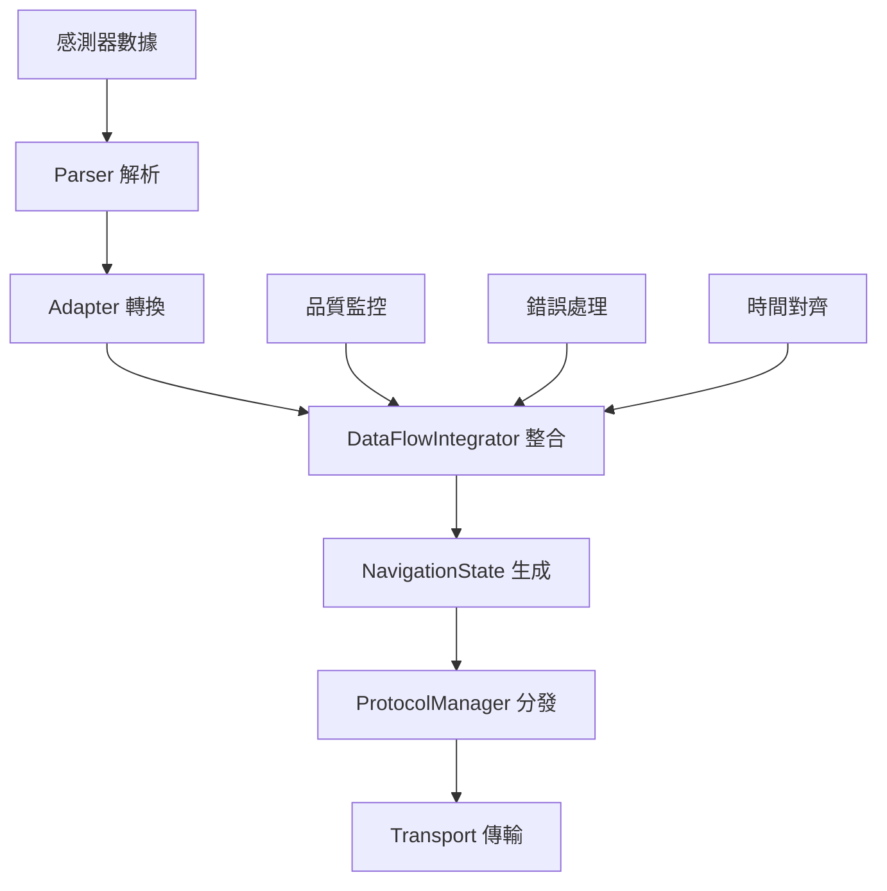

# GMINS 系統 FOUNDATION 核心架構筆記

> **版本**: v2.0.0  
> **更新日期**: 2025-08-22  
> **架構類型**: 高性能導航數據處理系統

## 🎯 系統概覽

GMINS (Generic Multi-source Inertial Navigation System) 是一個模組化的多源慣性導航系統，專門設計用於整合和處理來自不同感測器的導航數據。

### 核心設計理念
- **多源整合**: 支援 IMU、GNSS、氣壓計等多種感測器
- **協議無關**: 可處理 NMEA、MAVLink、XBUS 等多種協議
- **高性能**: 優化記憶體使用和堆疊管理
- **模組化**: 清晰的層級架構，便於擴展和維護

## 🏗️ 系統架構層級

```
┌─────────────────────────────────────────────────────────┐
│                   GMINS 系統架構                         │
├─────────────────────────────────────────────────────────┤
│ [應用層] SystemController → 系統狀態管理和協調          │
│ [整合層] DataFlowIntegrator → 數據流整合和品質控制      │
│ [適配層] Adapter → 數據格式轉換和驗證                   │
│ [協議層] Protocol → MAVLink/NMEA/自定義協議處理         │  
│ [解析層] Parser → 原始數據解析和格式化                  │
│ [傳輸層] Transport → UART/UDP/USB 通訊抽象             │
│ [通訊層] ByteSource → 低階位元組流處理                  │
└─────────────────────────────────────────────────────────┘
```

## 📦 核心模組功能

### 1. **SystemController** - 系統控制器
**位置**: `src/core/system_controller.h`

**功能**:
- 系統狀態管理 (INIT → RUNNING → ERROR → SHUTDOWN)
- 操作模式控制 (NORMAL/GPS_ONLY/IMU_ONLY/EMERGENCY)
- 協調各子系統工作
- 錯誤處理和恢復機制

**關鍵特點**:
```cpp
enum class SystemState {
    INIT, CALIBRATING, RUNNING, ERROR, SAFE_MODE, SHUTDOWN
};
enum class OperationMode {
    NORMAL, GPS_ONLY, IMU_ONLY, EMERGENCY  
};
```

### 2. **DataFlowIntegrator** - 數據流整合器
**位置**: `src/core/DataFlowIntegrator.h`

**功能**:
- 收集來自多個 Parser 的 IMU/GNSS 數據
- 調用 Adapter 進行數據轉換和驗證
- 組合成統一的 NavigationState
- Push→Pull 解耦設計，避免阻塞

**設計原則**:
- 極簡設計，只做必要的品質門檻檢查
- 單槽背壓設計（覆蓋最新值，無排隊）
- Header-only 實作，提升效能

### 3. **ProtocolManager** - 協議管理器
**位置**: `src/core/ProtocolManager.h`

**功能**:
- 管理多種通訊協議 (MAVLink, NMEA, 自定義)
- 協議切換和多工處理
- 數據路由和分發
- 協議特定的錯誤處理

### 4. **Adapter Layer** - 適配層
**位置**: `src/adapter/`

**模組**:
- **IMUAdapter**: IMU 數據格式轉換和校正
- **GNSSAdapter**: GPS/GNSS 座標轉換和驗證
- **NavigationAdapter**: 導航狀態統合和輸出格式化
- **CoordAdapter**: 座標系統轉換

**功能**:
- 統一不同感測器的數據格式
- 數據品質檢查和驗證
- 單位轉換和座標變換
- 時間戳對齊

## 🔄 數據流處理流程



### 典型數據處理週期:
1. **接收** - Transport 層接收原始位元組流
2. **解析** - Parser 將位元組流解析為結構化數據  
3. **適配** - Adapter 進行格式轉換和驗證
4. **整合** - DataFlowIntegrator 合併多源數據
5. **發布** - 透過 Protocol 層發送到目標系統

## 🚀 效能優化特點

### 記憶體管理
- **堆疊優化**: MAVLink 傳輸緩衝區從函數堆疊移至靜態成員，減少 94% 堆疊使用
- **零拷貝設計**: 盡可能使用指標和引用，減少數據複製
- **緩衝區複用**: 靜態緩衝區重複使用，降低記憶體碎片

### 並發控制  
- **跨平台互斥**: Arduino/ESP32/C++ 環境下的原子操作
- **RAII 模式**: 自動資源管理，防止死鎖
- **非阻塞設計**: Push-Pull 解耦，避免系統卡頓

### 即時效能
- **Header-only**: 關鍵路徑使用內聯函數，減少函數調用開銷
- **預編譯優化**: 編譯期常數和模板特化
- **批次處理**: 減少系統調用頻率

## 🔧 開發和除錯工具

### 1. **TDD Flow Checker**
- 測試驅動開發支援
- 自動化測試框架整合
- 品質門檻驗證

### 2. **Data Flow Monitor**  
- 即時數據流監控
- 效能指標追蹤
- 瓶頸識別和分析

### 3. **Log System**
- 分級日誌系統 (ERROR/WARN/INFO/DEBUG)
- 模組化日誌標籤
- 效能友好的日誌輸出

## 📋 支援的協議和格式

### 輸入協議:
- **NMEA 0183**: 標準 GPS 協議 (GGA, RMC, VTG)
- **XBUS**: Xsens IMU 原生協議
- **MAVLink**: 無人機/機器人通訊協議
- **自定義**: 可擴展的自定義協議支援

### 輸出格式:
- **MAVLink v2.0**: Pixhawk 飛控系統整合
- **NMEA**: 標準海事電子格式
- **JSON**: 網頁應用和調試
- **二進制**: 高效能數據記錄

## 🎛️ 配置和客製化

### 編譯時配置
```cpp
// src/config/compile_flags.h
#define GMINS_VERSION_MAJOR 2
#define GMINS_VERSION_MINOR 0  
#define DEBUG_LEVEL 2
#define USE_SERIAL_DEBUG 1
```

### 執行時參數
- 感測器取樣頻率調整
- 協議切換和多工配置
- 數據品質門檻設定
- 錯誤處理策略選擇

## 💡 使用場景

### 主要應用:
- **無人機導航**: 整合 GPS 和 IMU 提供精確導航
- **機器人定位**: 多感測器融合的室內外定位
- **海事導航**: NMEA 協議的船舶導航系統
- **車載系統**: 汽車導航和 ADAS 系統

### 優勢:
- 模組化設計便於客製化
- 高效能適合即時系統
- 跨平台支援 (Arduino/ESP32/PC)
- 豐富的協議支援

## 📚 相關文檔

- **API 參考**: 各模組 header 檔案中的詳細註解
- **範例程式**: `examples/` 目錄下的使用示例  
- **測試案例**: `tests/` 目錄下的單元測試
- **配置指南**: `docs/` 目錄下的詳細說明

---

> **注意**: 此系統為高效能即時導航系統，建議開發前詳細閱讀各層級的設計文檔和 API 規範。