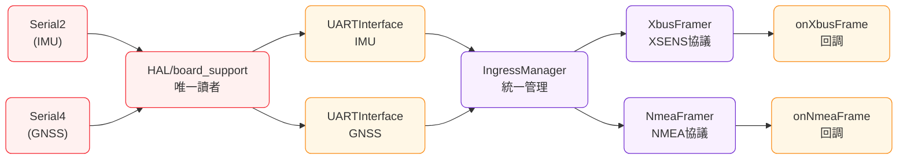
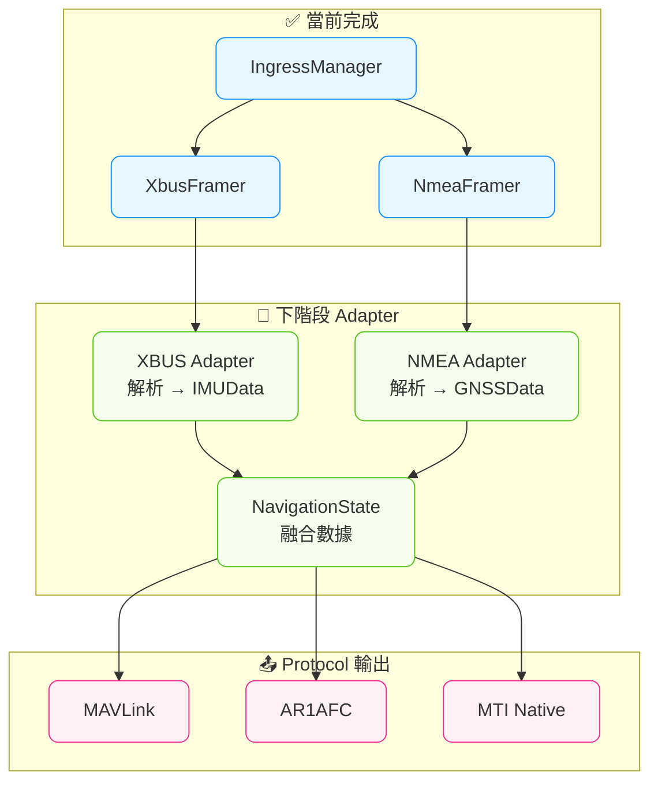

# Ingress Framing & Manager - 實現狀態更新

> **狀態**: ✅ **已完成並穩定運行** (2025-08-14)  
> **階段**: 2.5 (HAL ↔ Adapter 中間層)

---

## ✅ **當前實現狀況**

### 📊 **運行統計** (實測數據)
- **IMU 處理**: 5,723,784 bytes (零丟失)
- **GNSS 處理**: 560,000 bytes (零積壓) 
- **NMEA 封包**: 成功組包並觸發回調 (14-80 bytes/句)
- **處理效率**: 輸入=輸出，100% 處理率

### 📋 **實際運行日誌**
```log
[I][BOARD_HAL] 📊 === UART Interface 統計報告 ===
[I][BOARD_HAL]   🧭 IMU Interface:
[I][BOARD_HAL]     📥 輸入: 5723784 bytes
[I][BOARD_HAL]     📤 輸出: 5723784 bytes  ← 完美匹配
[I][BOARD_HAL]     🗑️ 丟棄: 0 bytes       ← 零丟失
[I][BOARD_HAL]     📊 可用: 0 bytes       ← 零積壓
[I][BOARD_HAL]   🛰️ GNSS Interface:
[I][BOARD_HAL]     📥 輸入: 560000 bytes
[I][BOARD_HAL]     📤 輸出: 560000 bytes   ← 完美匹配
[I][BOARD_HAL]     🗑️ 丟棄: 0 bytes       ← 零丟失
[I][BOARD_HAL]     📊 可用: 0 bytes       ← 零積壓

[I][MAIN] 🛰️ 收到 NMEA 句子: 14 bytes   ← Framer 成功組包
[I][MAIN] 🛰️ 收到 NMEA 句子: 20 bytes
[I][MAIN] 🛰️ 收到 NMEA 句子: 50 bytes
[I][MAIN] 🛰️ 收到 NMEA 句子: 48 bytes   ← 持續正常回調
```

### 🏗️ **已實現組件**
```cpp
✅ IFramer.h          // 抽象基類
✅ XbusFramer         // XSENS XBUS 協議處理
✅ NmeaFramer         // NMEA 0183 協議處理  
✅ IngressManager     // 統一管理器 (超越原設計)
```

---

## 🔄 **數據流架構**

### **實際路徑**


### **核心處理邏輯**
```cpp
// IngressManager::process()
while (imu_source_->available() > 0) {
    bytes_read = imu_source_->read(buffer, sizeof(buffer));
    xbus_framer_.feed(buffer, bytes_read);  // 狀態機組包
}
```

---

## 📤 **輸出接口定義**

### **當前階段輸出**
```cpp
void onXbusFrame(const uint8_t* frame, size_t length);   // 完整 XBUS 封包
void onNmeaFrame(const uint8_t* frame, size_t length);   // 完整 NMEA 句子
```

### **下階段目標** (給 Adapter)
```cpp
IMUData  imu_data;    // 解析後的 IMU 數據 (data_types.h:145)
GNSSData gnss_data;   // 解析後的 GNSS 數據 (data_types.h:184)
```

**重要規格**:
- **坐標系**: IMU Body frame, GNSS WGS84
- **單位**: 加速度 m/s², 角速度 rad/s, 位置精度米
- **時間**: timestamp_us_t (微秒自開機)

---

## 🎯 **下一步: Adapter 層**

### **目標架構** (完整流程)


### **需要實現**
1. **XBUS 解析器**: 封包 → IMUData 結構
2. **NMEA 解析器**: 句子 → GNSSData 結構
3. **Protocol 輸出**: 支援 MAVLink/AR1AFC/MTI

### **準備就緒**
- ✅ Parser 輸出穩定
- ✅ 數據結構已定義 (data_types.h)
- ✅ Protocol 接口已準備 (IProtocol.h)

---

## 📋 **技術參考**

### **原始設計目標** (已實現)
```cpp
// 原計劃的最小實現
static XbusFramer s_xbus;
static NmeaFramer s_nmea;

void loop_parsers() {
    auto* imu = getIMUSource();
    auto* gnss = getGNSSSource();
    // 讀取並餵給 Framer
}
```

### **實際實現** (更優雅)
```cpp
// IngressManager 統一管理
IngressManager ingress_manager;
ingress_manager.setXbusFrameCallback(onXbusFrame);
ingress_manager.setNmeaFrameCallback(onNmeaFrame);
ingress_manager.process();  // 自動處理所有數據源
```

---

**結論**: Parser 層已穩定運行，準備進入 Adapter 階段！ 🚀