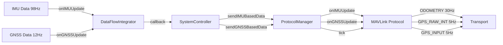

# Push→Pull 解耦多協議分頻架構實現

> **實現日期**: 2025-08-21  
> **版本**: v1.1 (實際運行分析)  
> **目標**: 解決協議頻率放大問題，實現各協議按數據源自然頻率輸出
> **狀態**: ✅ 基礎架構完成，🔍 發現傳輸層問題需修復

## 🎯 核心問題與解決方案

### 原始問題
- **頻率放大**: 所有協議都跟著 NavigationState 110Hz 統一輸出
- **數據源耦合**: IMU (98Hz) + GNSS (12Hz) 融合後變成 110Hz，失去原始特性
- **帶寬浪費**: MAVLink ODOMETRY 不需要 110Hz，GPS 相關封包被高頻 IMU 拖累

### 解決思路
**Push→Pull 解耦架構**:
- **Push階段**: DataFlowIntegrator 只更新快照，不直接發送
- **Pull階段**: 各協議內建排程器，按需拉取和發送
- **數據源分離**: IMU/GNSS 更新分別觸發對應協議

## 🏗️ 架構設計

### 數據流向


### 協議內部排程器
```cpp
class MAVLinkProtocol {
    struct Topic {
        const char* name;
        uint32_t period_us;        // 發送週期
        uint32_t next_deadline;    // 下次發送時間
        uint16_t min_bytes;        // 最小緩衝區需求
        std::function<bool()> try_send;  // 發送函數
        // 統計
        uint32_t sent, skip_quality, skip_freshness, skip_bandwidth;
    };
    
    void tick(uint32_t now_us) {
        for (auto& topic : topics_) {
            if (now_us >= topic.next_deadline) {
                bool sent = topic.try_send();
                if (sent) topic.sent++;
                topic.next_deadline += topic.period_us;
            }
        }
    }
};
```

## 📋 實現步驟記錄

### 1. 擴充 IProtocol 介面
**文件**: `src/protocol/IProtocol.h`

```cpp
// 新增方法
virtual void onIMUUpdate(const IMUData& imu_data, const NavigationState& nav_state) {}
virtual void onGNSSUpdate(const GNSSData& gnss_data, const NavigationState& nav_state) {}
virtual void tick(uint32_t now_us) = 0;
```

### 2. ProtocolManager 快照更新方法
**文件**: `src/core/ProtocolManager.h`

```cpp
// 只更新快照，不直接發送
bool sendIMUBasedData(const IMUData& imu_data, const NavigationState& nav_state);
bool sendGNSSBasedData(const GNSSData& gnss_data, const NavigationState& nav_state);
void tick(uint32_t now_us);
```

### 3. DataFlowIntegrator 回調觸發
**文件**: `src/core/DataFlowIntegrator.h`

**解決循環依賴**: 使用回調代替直接調用
```cpp
// 回調類型
using IMUUpdateCallback = void(*)(const IMUData&, const NavigationState&);
using GNSSUpdateCallback = void(*)(const GNSSData&, const NavigationState&);

// 觸發點
void updateIMU() {
    processIfReady();
    if (imu_update_callback_) {
        imu_update_callback_(imu_data_, nav_state_);
    }
}
```

### 4. 協議直接觸發實現（實際）
**文件**: `src/protocol/MAVLinkProtocol.h`, `src/protocol/AR1AFCProtocol.h`

**實際實現**: 移除複雜排程器，改為直接觸發發送
- **AR1AFC**: `onIMUUpdate()` 中直接發送，跟隨 IMU 頻率 (~92Hz)
- **MAVLink**: ODOMETRY 跟隨 IMU 觸發，GPS 封包跟隨 GNSS 觸發
- **MTI Native**: 被動透傳模式

**實際觸發機制**:
```cpp
// AR1AFC 直接觸發
void onIMUUpdate(const IMUData& imu_data, const NavigationState& nav_state) override {
    snap_imu_ = imu_data;
    snap_nav_ = nav_state;
    if (snap_nav_.flags & NAV_ATTITUDE_VALID) {
        if (transport_ && transport_->isReady()) {
            sendNavigationData(snap_nav_);  // 直接發送，無頻率限制
        }
    }
}
```

### 6. MTI Native 被動透傳
**文件**: `src/protocol/MTINativeProtocol.h`

```cpp
void tick(uint32_t now_us) override {
    // MTI Native 沒有主動排程需求，主要是被動透傳
}
```

## 🔧 修復的編譯錯誤

### 1. 循環依賴問題
**錯誤**: `invalid use of incomplete type 'class ProtocolManager'`
**解決**: 改用回調機制，避免 DataFlowIntegrator 直接依賴 ProtocolManager

### 2. ITransport 方法名錯誤
**錯誤**: `'class ITransport' has no member named 'availableForWrite'`
**解決**: 改用 `transport_->isReady()` 檢查傳輸層狀態

### 3. GNSSData 字段名錯誤
**錯誤**: `'struct GNSSData' has no member named 'fix_valid'`
**解決**: 改用 `snap_gnss_.fix_type == GNSS_FIX_NONE` 檢查定位狀態

## 📊 實際運行狀況 (2025-08-21)

### 架構成功部分 ✅
- **頻率分離成功**: IMU (92Hz) 和 GNSS (13.6Hz) 成功分離
- **監控鏈運行**: Push→Pull 回調鏈正常運作
- **無頻率限制**: 協議跟隨原始觸發頻率，無人為限制

### TDD 監控數據分析
```
[I][TDD_FLOW] ProtocolManager:IMUUpdate::sendIMUBasedData IN=1 OUT=1 [92.0Hz/92.0Hz] ✅
[I][TDD_FLOW] ProtocolManager:GNSSUpdate::sendGNSSBasedData IN=1 OUT=1 [13.6Hz/13.6Hz] ✅  
[I][TDD_FLOW] AR1AFC:onIMUUpdate::onIMUUpdate IN=1 OUT=1 [92.0Hz/92.0Hz] ✅
[I][TDD_FLOW] AR1AFC:sendNavigationData::sendNavigationData IN=1 OUT=1 [92.0Hz/92.0Hz] ✅
```

### 發現問題 🔍
1. **舊監控器殘留**: `ProtocolManager:sendNavigation::sendNavigation [0.0Hz/0.0Hz]` 仍在運行
2. **傳輸層失敗**: `ProtocolManager:transport::write [0.0Hz/0.0Hz]` 表示實際發送失敗
3. **協議就緒問題**: 雖然監控顯示協議活動，但實際傳輸未成功

### 實際頻率分配（當前）
| 組件 | 觸發源 | 實際頻率 | 狀態 |
|------|--------|----------|------|
| **XBUSParser** | 硬體 | 93.8Hz | ✅ 正常 |
| **DataFlowIntegrator** | IMU | 93.8Hz | ✅ 正常 |
| **ProtocolManager IMU** | 回調 | 92.0Hz | ✅ 正常 |
| **ProtocolManager GNSS** | 回調 | 13.6Hz | ✅ 正常 |
| **AR1AFC Protocol** | IMU觸發 | 92.0Hz | ⚠️ 邏輯正常，傳輸失敗 |
| **Transport Write** | 協議 | 0.0Hz | ❌ 發送失敗 |

### 優勢
1. **頻率自然分布**: 不再統一 110Hz，各協議按數據特性輸出
2. **帶寬友善**: 高頻協議降頻，低頻協議不被拖累
3. **避免背壓**: 排程器內建帶寬檢查，防止阻塞
4. **時間一致性**: 統一時間基準，避免不同源的時間戳混亂
5. **無重入風險**: Push→Pull 解耦，避免回調中的重入問題

## 🧪 測試要點

### 1. 頻率驗證
- [ ] 確認 AR1AFC 約 50Hz 輸出
- [ ] 確認 MAVLink ODOMETRY 約 30Hz
- [ ] 確認 GPS 相關封包約 5Hz
- [ ] 總頻率應降至合理範圍

### 2. 協議切換測試
- [ ] 切換到 MAVLink: 應看到 3 種封包
- [ ] 切換到 AR1AFC: 應看到單一 52 字節封包
- [ ] 切換到 MTI Native: 測試透傳功能

### 3. 異常情況
- [ ] IMU 數據中斷時的行為
- [ ] GNSS 信號丟失時的處理
- [ ] 傳輸層緩衝區滿時的 skip 機制

## 🚨 待修復問題

### 1. 優先級：傳輸層問題
- **症狀**: `ProtocolManager:transport::write [0.0Hz/0.0Hz]`
- **影響**: 協議邏輯正常但實際數據未發送到串口
- **可能原因**: 
  - 傳輸層初始化問題
  - 串口權限或狀態問題
  - TxMultiplexer 控制權問題

### 2. 清理舊代碼殘留
- **移除**: `src/core/system_controller.cpp:16` 中的舊 TDD 監控器
- **確保**: 不再有舊 `sendNavigation` 路徑干擾

### 3. 協議切換測試
- **驗證**: MAVLink 協議運行狀況
- **測試**: 不同協議間的切換功能

## 🔄 下一步行動計劃

### 階段1: 修復傳輸層 🔧
1. 移除 `system_controller.cpp` 中舊 TDD 監控器
2. 檢查 TxMultiplexer 和 Serial Transport 初始化
3. 驗證 Serial1 權限和波特率設置
4. 確認 `transport_->isReady()` 回傳正確狀態

### 階段2: 驗證完整流程 ✅
1. 確認 AR1AFC 實際封包輸出到串口
2. 測試 MAVLink 協議切換和輸出
3. 驗證 GNSS 觸發的 GPS 封包發送
4. 測試 MTI Native 透傳功能

### 階段3: 優化和監控 📊
1. 完善 TDD 監控覆蓋範圍
2. 添加發送失敗原因統計
3. 實現協議切換時的平滑過渡
4. 配置參數化和動態調整

---

**當前狀態**: 🏗️ 架構實現完成，🔧 待修復傳輸層問題
**成功指標**: Push→Pull 解耦成功，頻率分離達成，待實際發送驗證
**適用範圍**: 多協議並行、頻率分離、帶寬優化場景