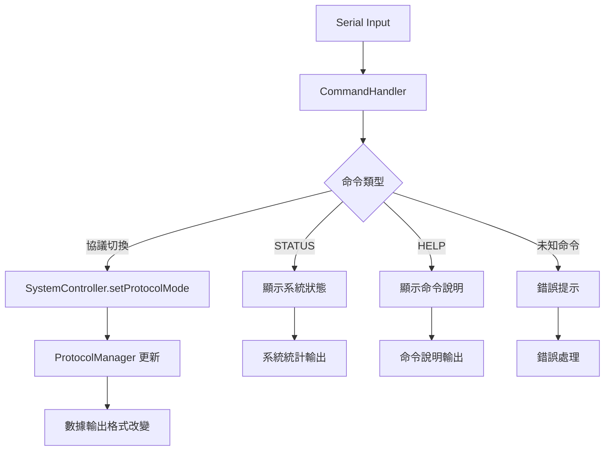

# Serial Command Handler System - 協議切換命令系統

> **創建日期**: 2025-08-18  
> **系統版本**: GMINS v1.0  
> **功能狀態**: ✅ 已實現並集成  
> **作者**: Claude Code Assistant

## 📋 **系統概述**

Serial Command Handler System 是 GMINS 系統的即時協議切換功能，允許用戶通過 Serial 命令動態切換不同的數據輸出協議，用於測試和調試不同設備的兼容性。

## 🎯 **核心功能**

### **主要特性**
- ⚡ **即時協議切換** - 無需重啟系統
- 🔄 **多協議支持** - AR1AFC、MAVLink、XBUS/MTI
- 📊 **系統狀態監控** - 實時顯示系統健康狀態
- 🎮 **簡單命令介面** - 直觀的文字命令
- 🛡️ **非侵入式設計** - 不影響主要數據處理流程

### **支持的協議**
1. **AR1AFC** - 自家封包格式
2. **MAVLink** - QGroundControl 兼容格式
3. **XBUS/MTI** - MTI 原始格式封包

## 🏗️ **系統架構**

```
GMINS Main Loop
├── CommandHandler.checkAndProcessCommands()
│   ├── Serial.available() 檢查
│   ├── 命令解析與驗證
│   └── SystemController.setProtocolMode()
│
└── 正常數據處理流程 (不受影響)
    ├── processOneCycle()
    ├── ProtocolManager 輸出
    └── TDD Flow 監控
```

## 📁 **文件結構**

```
src/util/
├── command_handler.h      # 命令處理器頭文件
└── command_handler.cpp    # 命令處理器實現

GMINS.ino                  # 主程序集成點
```

## 🔧 **實現細節**

### **CommandHandler 類設計**

```cpp
class CommandHandler {
private:
    SystemController* system_controller_;
    uint32_t* protocol_switches_counter_;
    uint32_t* nav_callbacks_counter_;
    uint32_t* total_cycles_counter_;

public:
    CommandHandler(SystemController* sys_ctrl, ...);
    void checkAndProcessCommands();
    
private:
    void handleProtocolSwitch(const String& protocol_name);
    void handleStatusCommand();
    void handleHelpCommand();
    void handleUnknownCommand(const String& cmd);
};
```

### **命令映射表**

| 用戶輸入 | 內部協議名稱 | 描述 |
|---------|-------------|------|
| `AR1AFC` | `AR1AFC` | 自家封包格式 |
| `MAVLINK` | `MAVLINK` | MAVLink 協議 |
| `XBUS` | `MTI_NATIVE` | MTI 原始格式 |
| `MTI` | `MTI_NATIVE` | MTI 原始格式 |

## 🎮 **使用指南**

### **基本命令**

```bash
# 協議切換命令
AR1AFC          # 切換到自家封包格式
MAVLINK         # 切換到 MAVLink 格式 (QGroundControl)
XBUS            # 切換到 MTI 原始格式
MTI             # 同 XBUS (別名)

# 系統監控命令
STATUS          # 顯示系統狀態和統計信息
HELP            # 顯示命令說明

# 範例輸出
✅ 協議切換成功: MAVLINK
📡 MAVLink: 輸出 MAVLink 封包 (適用 QGroundControl)
```

### **STATUS 命令輸出範例**

```
📊 === 系統狀態 ===
📊 當前協議: MAVLINK
📊 協議切換次數: 3
📊 導航回調次數: 1247
📊 系統循環次數: 45892
📊 系統健康: 正常 (錯誤代碼: 0x00)
📊 系統狀態: 運行中
📊 ==================
```

## 🔄 **數據流程**



## ⚡ **性能特性**

### **低延遲設計**
- **非阻塞檢查**: `Serial.available()` 快速檢查
- **最小開銷**: 只在有命令時才處理
- **即時生效**: 協議切換立即應用

### **記憶體使用**
- **靜態分配**: 命令處理器一次性創建
- **字串優化**: 使用 Arduino String 類進行處理
- **計數器引用**: 直接引用統計變數，無複製開銷

## 🛡️ **錯誤處理**

### **輸入驗證**
```cpp
// 自動轉大寫和去空白
cmd.trim();
cmd.toUpperCase();

// 未知命令處理
if (cmd.length() > 0) {
    handleUnknownCommand(cmd);
}
```

### **系統狀態檢查**
```cpp
if (!system_controller_) {
    LOGE("❌ SystemController 未初始化");
    return;
}
```

## 🔧 **集成方式**

### **GMINS.ino 修改點**

```cpp
// 1. 引入頭文件
#include "src/util/command_handler.h"

// 2. 全域變數
CommandHandler* command_handler = nullptr;

// 3. setup() 中初始化
command_handler = new CommandHandler(system_controller, 
                                   &sys_stats.protocol_switches,
                                   &sys_stats.nav_callbacks,
                                   &sys_stats.total_cycles);

// 4. loop() 中調用
if (command_handler) {
    command_handler->checkAndProcessCommands();
}
```

## 🧪 **測試用例**

### **協議切換測試**
```bash
# 測試序列
1. AR1AFC   -> 確認輸出自家格式
2. MAVLINK  -> 確認輸出 MAVLink 格式
3. XBUS     -> 確認輸出 MTI 格式
4. STATUS   -> 檢查切換次數 = 3
```

### **錯誤處理測試**
```bash
# 輸入無效命令
INVALID_CMD
# 預期輸出:
❓ 未知命令: INVALID_CMD
💡 輸入 HELP 查看可用命令
```

## 📊 **監控與調試**

### **TDD Flow 整合**
- **不影響現有 TDD 檢查器**
- **保持數據流監控正常運行**
- **命令處理不計入主要統計**

### **日誌輸出**
```cpp
#define LOG_TAG "CMD_HANDLER"
LOGI("✅ 協議切換成功: %s", protocol.c_str());
LOGE("❌ 協議切換失敗: %s", protocol.c_str());
```

## 🚀 **未來擴展計劃**

### **可能的增強功能**
1. **批量命令**: 支援多個命令組合
2. **配置儲存**: 記住上次使用的協議
3. **遠程命令**: 支援網路命令介面
4. **命令歷史**: 記錄命令執行歷史
5. **自動切換**: 根據連接設備自動選擇協議

### **整合建議**
- 與現有的 ProtocolManager 完全兼容
- 可輕鬆擴展新協議支援
- 保持與 SystemController 的鬆耦合設計

## 📝 **使用注意事項**

### **最佳實踐**
1. **測試環境**: 建議在測試環境中使用協議切換
2. **數據一致性**: 切換協議時注意數據連續性
3. **設備兼容**: 確認目標設備支援選定協議

### **限制事項**
- 需要 Serial 連接進行命令輸入
- 命令需要手動輸入（目前不支持腳本）
- 協議切換會影響正在傳輸的數據

---

**📞 技術支援**: 如有問題，請參考 GMINS 主要文檔或聯繫開發團隊