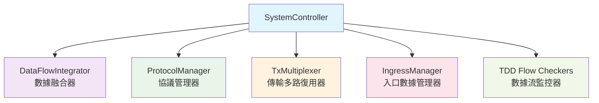
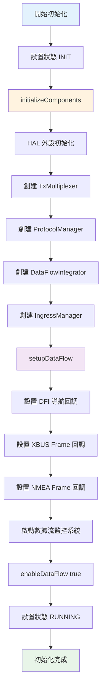
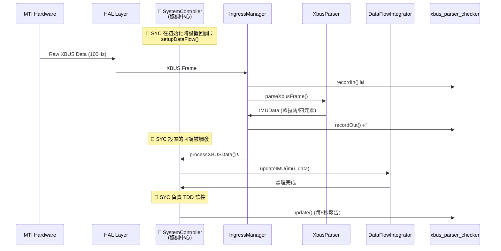
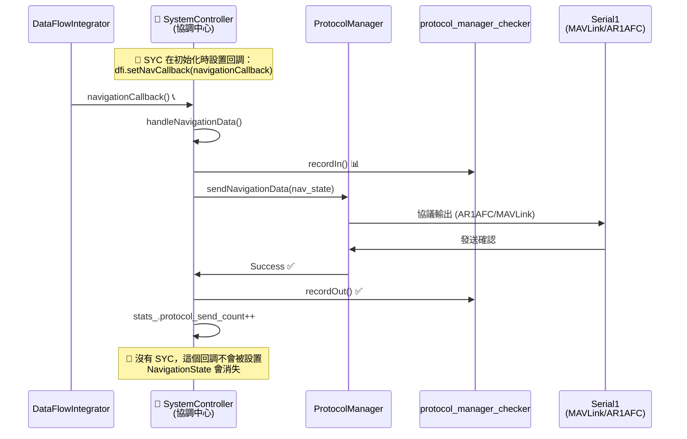
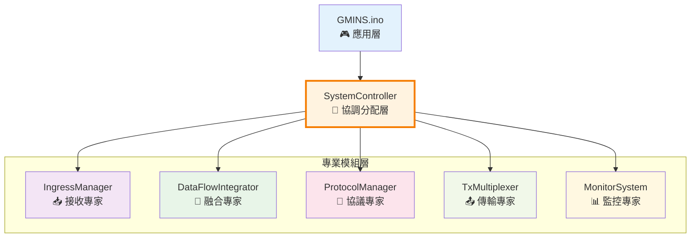
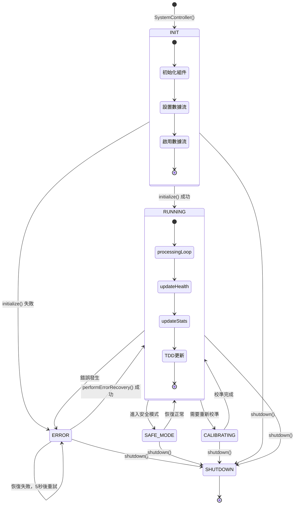
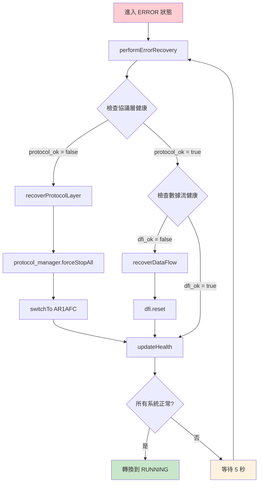

# SystemController 流程筆記

## 系統概覽
SystemController 是 GMINS 的核心控制器，負責協調所有子系統的運行和數據流管理。

## 核心組件架構


## 初始化流程 (initialize())


## 主運行循環 (tick())
```
if (SystemState::RUNNING) {
    1. processingLoop()           # 處理一個週期的數據
       ├── ingress_manager_.process()  # 處理輸入數據
       └── dfi_.tick()                # 處理數據融合
    
    2. updateHealth()             # 更新系統健康狀態
    3. updateStats()              # 更新統計信息
    4. TDD 檢測器更新
       ├── xbus_parser_checker.update()
       ├── data_integrator_checker.update()
       └── protocol_manager_checker.update()
}
```

## Integration Layer 數據流 - SystemController 核心協調角色

### 🎯 **SystemController (SYC) 的關鍵職責**

SystemController 是整個數據流的**中央指揮官**，沒有它系統將完全無法運作：

#### **1. 數據流路由控制** 
- **設置所有回調函數** - 告訴各模組「數據處理完後要傳給誰」
- **協調組件通訊** - 確保 IngressManager ↔ DataFlowIntegrator ↔ ProtocolManager 正確連接
- **管理生命週期** - 初始化順序、關閉順序、錯誤恢復

#### **2. 系統狀態監督**
- **健康檢查協調** - 監控所有子系統是否正常運作
- **錯誤處理決策** - 當某個組件失效時，決定如何恢復
- **協議切換管理** - 根據情況動態切換輸出協議

#### **3. 統計與診斷**
- **TDD 監控整合** - 收集並報告整個系統的性能數據
- **數據流統計** - 追蹤處理次數、成功率、錯誤率

### ❌ **如果沒有 SystemController 會發生什麼？**

1. **🔌 回調函數無人設置**
   ```cpp
   // DataFlowIntegrator 不知道數據處理完要傳給誰
   dfi->setNavCallback(???);  // ❌ 無人設置，數據會消失
   
   // IngressManager 不知道收到數據要傳給誰  
   ingress->setXBUSCallback(???);  // ❌ 無人設置，原始數據被丟棄
   ```

2. **🚫 組件間無法通訊**
   ```cpp
   // 各模組都獨立運作，彼此不知道對方存在
   IngressManager ingress;    // 接收數據，但不知道要傳給誰
   DataFlowIntegrator dfi;    // 等待數據，但沒人餵給它  
   ProtocolManager pm;        // 等待導航數據，但收不到
   // 結果：數據在各模組中孤立，無法形成完整流程
   ```

3. **💥 系統無法啟動**
   ```cpp
   // 沒人負責初始化順序，可能導致依賴錯誤
   DataFlowIntegrator dfi;              // ❌ 需要回調但沒設置
   ProtocolManager pm(&uninitialized);  // ❌ 依賴未初始化組件
   ```

4. **🔥 錯誤無法恢復**
   - 當某個模組出錯時，沒人知道要重置誰、重啟誰
   - 系統會一直卡在錯誤狀態，無法自我修復

### 🔄 **完整數據流程 - 由 SYC 協調**

#### **XBUS 數據處理流程**


#### **Navigation 數據處理流程**  


### 🧠 **SystemController 是系統的「大腦」**

- **🔧 設置階段**: 告訴所有組件「你的數據要傳給誰」
- **🔄 運行階段**: 接收並路由所有重要數據流
- **🏥 監控階段**: 持續檢查系統健康，必要時進行修復
- **📊 報告階段**: 統計並報告整個系統的運行狀況

**沒有 SystemController，GMINS 就像一群各自為政的模組，無法形成有機的整體系統！** 🎯

## 🎯 **SystemController 作為分配器和協調器的深入理解**

### 📋 **外部依賴清單 (.h 文件分析)**

SystemController.h 的 `#include` 列表就是它的「能力需求清單」：

```cpp
#include "../data/data_types.h"           // 📦 數據結構定義 - 我需要知道數據格式
#include "DataFlowIntegrator.h"           // 🔄 數據融合器 - 我需要融合能力  
#include "ProtocolManager.h"              // 📡 協議管理器 - 我需要協議輸出能力
#include "../transport/TxMultiplexer.h"   // 📤 傳輸多路復用器 - 我需要多通道傳輸
#include "../parsers/ingress_manager.h"   // 📥 數據接收管理器 - 我需要數據接收能力
#include "../util/log.h"                  // 📝 日誌系統 - 我需要記錄能力
#include "../util/data_flow_monitor.h"    // 📊 監控系統 - 我需要監控能力
```

**核心思想**: `.h` 文件顯示了 SystemController **需要引用哪些外部模組**來完成自己的協調工作。

### 🏗️ **內部組件管理 (私有成員變數)**

SystemController 內部持有所有關鍵組件的指針，實現「總指揮官」角色：

```cpp
class SystemController {
private:
    // 🎯 我控制的專業團隊
    DataFlowIntegrator* dfi_;              // 數據融合專家
    ProtocolManager* protocol_manager_;    // 協議輸出專家  
    TxMultiplexer* tx_multiplexer_;        // 傳輸管理專家
    IngressManager* ingress_manager_;      // 數據接收專家
    monitor::MultiChannelMonitor mcm_;     // 監控分析專家
    
    // 🎛️ 系統狀態控制
    SystemState current_state_;            // 當前系統狀態
    bool data_flow_enabled_;               // 數據流開關
    SystemStats stats_;                    // 系統統計信息
};
```

### 🎯 **實際分配工作的代碼例子**

#### **1. XBUS 數據分配 (數據接收 → 融合)**
```cpp
// system_controller.cpp - processXBUSData()
void processXBUSData(const uint8_t* data, size_t length) {
    // 🎯 SYC 決策：XBUS原始數據 → 交給融合器處理
    if (dfi_) {
        dfi_->updateIMU(imu_data);  // 分配任務給數據融合專家
    }
    
    // 📊 SYC 同時負責統計監控
    xbus_parser_checker.recordIn();
    // ... 處理完成後 ...
    xbus_parser_checker.recordOut();
}
```

#### **2. 導航數據分配 (融合結果 → 協議輸出)**
```cpp
// system_controller.cpp - handleNavigationData()  
void handleNavigationData(const NavigationState& nav_state) {
    // 🎯 SYC 決策：融合完的導航數據 → 交給協議管理器發送
    if (protocol_manager_) {
        protocol_manager_->sendNavigationData(nav_state);  // 分配任務給協議專家
    }
    
    // 📈 SYC 同時更新統計
    stats_.protocol_send_count++;
}
```

#### **3. 協議切換分配 (應用需求 → 協議管理)**
```cpp  
// system_controller.cpp - setProtocolMode()
bool setProtocolMode(ProtocolType protocol_type) {
    // 🎯 SYC 決策：協議切換需求 → 交給協議管理器執行
    if (protocol_manager_) {
        return protocol_manager_->switchToProtocol(protocol_type);  // 分配任務
    }
    return false;
}
```

### 🏢 **系統架構層級圖**



### 💼 **職場比喻：SystemController = 專案經理**

#### **🎯 專案經理 (SystemController) 的日常工作：**

1. **📋 需求分析階段** (.h 文件的 include)
   ```cpp
   // 專案經理分析：「我需要哪些專業團隊？」
   #include "DataFusionTeam.h"      // 需要數據分析團隊
   #include "ProtocolTeam.h"        // 需要協議開發團隊  
   #include "NetworkTeam.h"         // 需要網路傳輸團隊
   ```

2. **👥 團隊組建階段** (private 成員變數)
   ```cpp
   private:
       DataFusionTeam* data_team_;     // 我管理數據分析團隊
       ProtocolTeam* protocol_team_;   // 我管理協議開發團隊
       NetworkTeam* network_team_;     // 我管理網路傳輸團隊
   ```

3. **📋 任務分配階段** (實際的分配函數)
   ```cpp
   void assignTask(NewRequirement req) {
       if (req.type == DATA_PROCESSING) {
           data_team_->handleTask(req);      // 數據任務給數據團隊
       } else if (req.type == PROTOCOL_OUTPUT) {
           protocol_team_->handleTask(req);  // 協議任務給協議團隊
       }
   }
   ```

### 🔄 **為什麼要分開 GMINS.ino 和 SystemController？**

#### **職責分離的實際例子：**

| 角色 | GMINS.ino (客戶/老闆) | SystemController (專案經理) |
|------|----------------------|----------------------------|
| **關注點** | 「我要什麼結果」 | 「如何達成結果」 |
| **具體例子** | `reportSystemStats()` 顯示統計 | `dfi_->updateIMU()` 分配數據處理 |
| **複雜度** | 簡單直觀 | 複雜的內部協調 |
| **代碼例子** | `system_controller->tick()` | `processingLoop()` 內部循環 |

#### **實際代碼對比：**

**GMINS.ino (簡潔的應用邏輯):**
```cpp
void loop() {
    system_controller->tick();    // 🎯 一行搞定所有系統工作
    reportSystemStats();         // 📊 專注於用戶關心的統計
    HEARTBEAT(10000);            // ❤️ 用戶界面反饋
}
```

**SystemController (複雜的內部協調):**
```cpp
void tick() {
    processingLoop();            // 🔄 協調數據流處理
        ├── ingress_manager_->process()     // 分配接收任務
        ├── dfi_->tick()                   // 分配融合任務
        └── protocol_manager_->send()      // 分配輸出任務
    updateHealth();              // 🏥 監控系統健康
    updateStats();               // 📈 更新內部統計
    updateTDDCheckers();         // 📊 更新監控器
}
```

### 🎯 **核心設計哲學**

**SystemController 實現了「控制器模式」的精髓：**

1. **🎯 單一責任**: 只負責協調，不做具體的數據處理
2. **🔄 依賴注入**: 通過引用外部模組獲得能力
3. **📋 任務分配**: 根據數據類型和需求分配給專業模組
4. **🏥 統一管理**: 提供統一的控制接口和錯誤恢復

**簡單說：SystemController 就像交響樂團的指揮家，不演奏任何樂器，但協調所有音樂家創造出美妙的音樂！** 🎼🎯

## 關鍵方法說明

### initializeComponents()
- **用途**: 創建並初始化所有核心組件
- **順序**: HAL → TxMux → ProtocolMgr → DFI → IngressMgr

### setupDataFlow() 
- **用途**: 建立組件間的數據流連接
- **重點**: 設置 XBUS/NMEA 回調，啟動 TDD 監控

### processingLoop()
- **用途**: 每個 tick 週期處理數據
- **流程**: 處理輸入 → 數據融合 → 統計更新

### handleNavigationData()
- **用途**: 處理來自 DFI 的導航數據
- **流程**: 接收 → TDD 記錄 → 發送到協議層

## TDD 流程檢測器

### Integration Layer 監控點
1. **XBUSParser::parseFrame** 
   - 監控 XBUS 數據解析成功率
   - 位置: XBUS Frame Callback

2. **DataFlowIntegrator::processIMU**
   - 監控 DFI IMU 數據處理
   - 位置: XBUS Frame Callback

3. **ProtocolManager::sendNavigation**  
   - 監控協議層數據發送
   - 位置: handleNavigationData()

### 預期 TDD 輸出
```
XBUSParser::parseFrame IN=1 OUT=1         # XBUS 解析成功
DataFlowIntegrator::processIMU IN=1 OUT=1  # DFI 處理成功  
ProtocolManager::sendNavigation IN=1 OUT=1 # 協議發送成功
```

## 系統狀態機

### SystemState 狀態轉換圖


## 錯誤處理機制

### 錯誤恢復流程


### 健康檢查項目
```mermaid
mindmap
  root)健康檢查系統(
    DFI 健康
      hasValidNavigation()
      數據新鮮度檢查
      融合狀態驗證
    協議健康
      hasActiveProtocol()
      傳輸狀態檢查
      協議切換狀態
    入口健康
      isInitialized()
      UART 連接狀態
      數據接收率
    通訊健康
      protocol_ok && ingress_ok
      整體通訊狀態
      錯誤計數監控
```

## 統計信息追蹤

### SystemStats 結構
- `total_cycles`: 總處理週期數
- `dfi_process_count`: DFI 處理次數
- `protocol_send_count`: 協議發送次數  
- `error_recovery_count`: 錯誤恢復次數
- `last_nav_timestamp`: 最後導航時間戳

## 外部接口

### 公開方法
- `initialize()`: 系統初始化
- `tick()`: 單次處理週期
- `run()`: 主循環運行
- `shutdown()`: 系統關閉
- `setProtocolMode()`: 協議切換
- `enableDataFlow()`: 數據流控制

### 存取器
- `getDataFlowIntegrator()`: 獲取 DFI 實例
- `getProtocolManager()`: 獲取協議管理器
- `getState()`: 獲取系統狀態
- `getHealth()`: 獲取健康狀態
- `getStats()`: 獲取統計信息

## 代碼位置參考

### 主要文件
- 實現文件: `src/core/system_controller.cpp`
- 頭文件: `src/core/system_controller.h`

### 關鍵代碼行數
- TDD 檢測器定義: system_controller.cpp:14-16
- XBUS 回調監控: system_controller.cpp:291-301  
- Navigation 回調監控: system_controller.cpp:372-383
- TDD 更新調用: system_controller.cpp:87-90

### 相關組件文件
- DataFlowIntegrator: `src/core/DataFlowIntegrator.h`
- ProtocolManager: `src/core/ProtocolManager.h`
- TDD Flow Checker: `src/util/tdd_flow_checker.h`