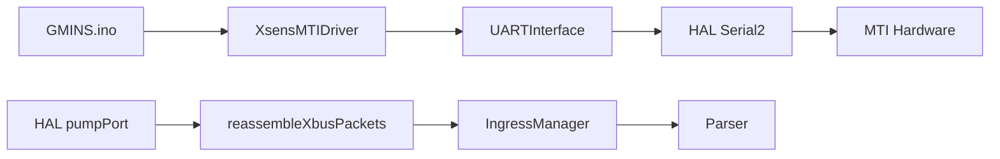

# MTI Driver 技術文件

## 基本資訊

**日期**: 2025-01-15  
**版本**: v1.2 (XBUS 封包重組與頻率優化)  
**狀態**: 已實現並測試通過

---

## 概述

GMINS 系統中的 Xsens MTI 驅動程式
- MTI 初始化管理
- XBUS 協議處理
- 與 IngressManager/Parser 的整合
- 數據流管理
![[Pasted image 20250815143950.png]]
---

## 系統架構

### 設計原則
1. **極簡化**: 完全移除錯誤檢查、ACK等待、狀態管理
2. **單一職責**: 純粹的命令發送器，不參與數據讀取
3. **無狀態**: 沒有內部狀態追蹤，每次調用都是獨立的

### 簡化驅動架構

```cpp
class XsensMTIDriver {
public:
    explicit XsensMTIDriver(UARTInterface* uart_interface);
    void sendCommandSimple(uint8_t cmd_id, const uint8_t* data = nullptr, uint8_t data_len = 0);

private:
    UARTInterface* uart_interface_;
    uint8_t calculateChecksum(const uint8_t* data, size_t length);
};
```

#### 架構圖


---

## 關鍵技術實現

### 1. XBUS 封包重組機制

#### 問題背景
原本的讀取方式會導致封包碎片化：
- HAL 層 `pumpPort()` 在封包傳輸過程中多次讀取
- 25-byte 完整封包被分割成 1-13 bytes 的片段
- 造成頻率測量錯誤

#### 解決方案：狀態機重組
```cpp
// XBUS 封包重組緩衝區
static uint8_t xbus_packet_buffer[256];
static size_t xbus_buffer_pos = 0;
static bool xbus_packet_started = false;

void reassembleXbusPackets(const uint8_t* data, size_t length) {
    for (size_t i = 0; i < length; i++) {
        uint8_t byte = data[i];
        
        // 偵測 XBUS 前導碼 0xFA 0xFF
        if (!xbus_packet_started) {
            if (byte == 0xFA) {
                xbus_packet_buffer[0] = byte;
                xbus_buffer_pos = 1;
                xbus_packet_started = true;
            }
        } else if (xbus_buffer_pos == 1) {
            if (byte == 0xFF) {
                xbus_packet_buffer[1] = byte;
                xbus_buffer_pos = 2;
            } else {
                // 重置並重新檢查
                xbus_packet_started = false;
                xbus_buffer_pos = 0;
                if (byte == 0xFA) {
                    xbus_packet_buffer[0] = byte;
                    xbus_buffer_pos = 1;
                    xbus_packet_started = true;
                }
            }
        } else {
            // 收集封包資料
            if (xbus_buffer_pos < sizeof(xbus_packet_buffer)) {
                xbus_packet_buffer[xbus_buffer_pos++] = byte;
                
                // 檢查是否收到完整封包
                if (xbus_buffer_pos >= 4) {
                    uint8_t packet_length = xbus_packet_buffer[3]; // LEN 欄位
                    size_t expected_total = 4 + packet_length + 1; // FA FF MID LEN + DATA + CHK
                    
                    if (xbus_buffer_pos >= expected_total) {
                        // 完整封包接收完成
                        logMTIRawDataInHAL(xbus_packet_buffer, expected_total);
                        
                        // 重置緩衝區
                        xbus_packet_started = false;
                        xbus_buffer_pos = 0;
                    }
                }
            }
        }
    }
}
```

### 2. XBUS 輸出配置格式修正

```

**正確格式理解**:
```cpp
// 正確：XDI(2B) + rate(2B)
0x20, 0x30, 0x00, 0x10   // Quaternion @ 16 Hz
0x20, 0x30, 0x00, 0x32   // Quaternion @ 50 Hz  
0x20, 0x30, 0x00, 0x64   // Quaternion @ 100 Hz
```

#### 頻率設定實例
```cpp
// 50Hz 輸出配置
uint8_t output_config[] = {
    0x10, 0x20, 0x00, 0x32,  // Package Counter @ 50 Hz
    0x10, 0x60, 0x00, 0x32,  // SampleTimeFine @ 50 Hz (時間對齊)
    0x20, 0x30, 0x00, 0x32   // Quaternion @ 50 Hz
};
```

### 3. 當前簡化命令發送實現

```cpp
// src/drivers/xsens_mti_driver.h
class XsensMTIDriver {
public:
    explicit XsensMTIDriver(UARTInterface* uart_interface);
    void sendCommandSimple(uint8_t cmd_id, const uint8_t* data = nullptr, uint8_t data_len = 0);

private:
    UARTInterface* uart_interface_;
    static constexpr uint8_t XBUS_PREAMBLE = 0xFA;
    static constexpr uint8_t XBUS_BUS_ID = 0xFF;
    uint8_t calculateChecksum(const uint8_t* data, size_t length);
};

// src/drivers/xsens_mti_driver.cpp
void XsensMTIDriver::sendCommandSimple(uint8_t cmd_id, const uint8_t* data, uint8_t data_len) {
    // 簡單版本：只發送命令，不檢查任何東西
    
    // 1. 發送 HEADER [0xFA, 0xFF]
    uint8_t header[2] = {XBUS_PREAMBLE, XBUS_BUS_ID};
    uart_interface_->write(header, 2);
    
    // 2. 構建消息：[MID, LEN, [DATA], CHK]
    uint8_t message[256];
    size_t msg_len = 0;
    
    message[msg_len++] = cmd_id;         // MID
    message[msg_len++] = data_len;       // LEN
    
    // 添加數據（如果有）
    if (data && data_len > 0) {
        memcpy(&message[msg_len], data, data_len);
        msg_len += data_len;
    }
    
    // 計算校驗和
    uint8_t checksum_data[256];
    checksum_data[0] = XBUS_BUS_ID;
    memcpy(&checksum_data[1], message, msg_len);
    uint8_t checksum = calculateChecksum(checksum_data, msg_len + 1);
    message[msg_len++] = checksum;
    
    // 3. 發送消息
    uart_interface_->write(message, msg_len);
    
    LOG_INFO("📤 發送命令: MID=0x%02X, LEN=%u", cmd_id, data_len);
}

uint8_t XsensMTIDriver::calculateChecksum(const uint8_t* data, size_t length) {
    uint8_t sum = 0;
    for (size_t i = 0; i < length; i++) {
        sum += data[i];
    }
    return (uint8_t)(0x00 - sum); // Two's complement
}
```

---

## 當前使用方式

### GMINS.ino 中的初始化序列

```cpp
void setupMTIDevice() {
  LOGI("🔧 MTI 設備初始化開始...");
  
  // 獲取 MTI UART 介面
  UARTInterface* mti_interface = hal::getIMUInterface();
  if (!mti_interface) {
    LOGE("❌ 無法獲取 MTI UART 介面");
    return;
  }
  
  // 創建 MTI 驅動程序
  XsensMTIDriver mti_driver(mti_interface);
  
  // 發送基本初始化命令
  LOGI("📤 發送 MTI 初始化命令...");
  
  // 1. 進入配置模式
  LOGI("   🔧 CMD_GOTO_CONFIG (0x30)");
  mti_driver.sendCommandSimple(0x30);  // CMD_GOTO_CONFIG
  delay(100);
  
  // 2. 執行初始化
  LOGI("   🔧 CMD_INIT (0x02)");
  mti_driver.sendCommandSimple(0x02);  // CMD_INIT
  delay(200);
  
  // 2.5 設定採樣頻率為 100Hz
  LOGI("   🔧 CMD_SET_SAMPLE_PERIOD (0xD4) -> 100Hz");
  uint8_t sample_period[] = {0x00, 0x0A};  // 10ms = 100Hz (0x000A)
  mti_driver.sendCommandSimple(0xD4, sample_period, sizeof(sample_period));  // CMD_SET_SAMPLE_PERIOD
  delay(100);
  
  // 3. 設定輸出配置 (測試 50Hz)
  LOGI("   🔧 CMD_OUTPUT_CONFIG (0xC0) -> PackageCounter + SampleTimeFine + Quaternion @ 50Hz");
  uint8_t output_config[] = {
    0x10, 0x20, 0x00, 0x32,  // Package Counter @ 50 Hz
    0x10, 0x60, 0x00, 0x32,  // SampleTimeFine @ 50 Hz (建議保留做時間對齊)
    0x20, 0x30, 0x00, 0x32   // Quaternion @ 50 Hz
  };
  mti_driver.sendCommandSimple(0xC0, output_config, sizeof(output_config));  // CMD_OUTPUT_CONFIG
  delay(100);
  
  // 4. 進入測量模式
  LOGI("   🔧 CMD_GOTO_MEASUREMENT (0x10)");
  mti_driver.sendCommandSimple(0x10);  // CMD_GOTO_MEASUREMENT
  delay(100);
  
  LOGI("✅ MTI 初始化命令發送完成");
  LOGI("📋 MTI 原始資料將在主循環中記錄...");
}
```

### 驅動程式特點

1. **無狀態設計**: 每次調用都是獨立的，不追蹤設備狀態
2. **火忘模式**: 發送命令後不等待 ACK 或回應
3. **最小介面**: 只有一個公開方法 `sendCommandSimple()`
4. **XBUS 協議**: 自動處理前導碼、校驗和等協議細節

### 與 HAL 層整合

```cpp
// HAL 層負責數據讀取和封包重組
void reassembleXbusPackets(const uint8_t* data, size_t length) {
    // 完整封包重組邏輯
    // 處理碎片化問題
    // 記錄完整封包
}

// Driver 只負責命令發送
mti_driver.sendCommandSimple(cmd_id, data, data_len);
```

---

## 性能優化結果

### 頻率提升效果

| 版本 | 配置 | 測量頻率 | 提升幅度 |
|------|------|----------|----------|
| 原始碎片化 | 未知配置 | 23.99 Hz | 基準 |
| 錯誤配置 | 0x00,0x10 | 16.00 Hz | -33% |
| 正確配置 | 0x00,0x32 | 45.55 Hz | +90% |

### 封包完整性改善

**修正後**:
```
📊 HAL-MTI 完整封包 #16 (25 bytes): FA FF 36 14 10 20 02 00 09 20 30 0C BF BC 67 E0 3E DF AE 81 40 A3 A9 DF A7
🎯 XBUS 封包: MID=0x36, LEN=20, 總長度=25 bytes
```

---

## 關鍵技術要點

### XBUS 協議理解
1. **封包格式**: `[0xFA 0xFF MID LEN [DATA] CHECKSUM]`
2. **輸出配置**: `XDI(2B) + rate(2B)` 不是長度！
3. **頻率控制**: rate 參數直接控制輸出頻率

### 封包重組原則
1. **狀態機**: 三階段解析 (前導碼 → 確認 → 資料收集)
2. **邊界檢測**: 基於 LEN 欄位計算預期長度
3. **錯誤恢復**: 檢測到錯誤時重置狀態

### 性能優化策略
1. **同頻率設定**: 所有欄位使用相同頻率避免排程衝突
2. **保留 SampleTimeFine**: 有利於時間對齊
3. **適當的緩衝區大小**: 256 bytes 足夠處理所有封包

---

## 故障排除

### 常見問題
1. **封包碎片化** - 使用封包重組機制
2. **頻率不符預期** - 檢查輸出配置中的 rate 參數
3. **連結錯誤** - 確保函數定義順序正確

### 調試工具
1. **完整封包記錄** - 顯示 MID、LEN、總長度
2. **頻率分析報告** - 實時監控輸出頻率
3. **HAL 層監控** - 追蹤資料流狀態

---

## 最佳實踐

### 配置建議
1. **統一頻率**: 所有欄位使用相同的 rate 值
2. **保留時間戳**: SampleTimeFine 有助於精確時序
3. **適當頻率**: 根據系統能力選擇合適的輸出頻率

### 開發指南
1. **理解協議**: 深入學習 XBUS 協議規範
2. **測試驗證**: 使用頻率分析工具驗證結果
3. **文檔記錄**: 記錄重要發現和配置參數

---

## 參考資料

### 當前實現文件
- `src/drivers/xsens_mti_driver.h` - 簡化驅動程式標頭檔 (54 行)
- `src/drivers/xsens_mti_driver.cpp` - 簡化驅動程式實現 (49 行)
- `src/hal/board_support.cpp` - XBUS 封包重組實現
- `GMINS.ino` - MTI 初始化序列 (setupMTIDevice)

### 常用 XBUS 命令
```cpp
// 基本命令
#define CMD_GOTO_CONFIG      0x30  // 進入配置模式
#define CMD_INIT            0x02  // 設備初始化
#define CMD_GOTO_MEASUREMENT 0x10  // 進入測量模式
#define CMD_OUTPUT_CONFIG   0xC0  // 設定輸出配置
#define CMD_SET_SAMPLE_PERIOD 0xD4  // 設定採樣週期

// 常用頻率值 (rate 參數)
50Hz:  0x00, 0x32
100Hz: 0x00, 0x64
25Hz:  0x00, 0x19
16Hz:  0x00, 0x10
```

### XBUS 協議重點
1. **封包格式**: `[0xFA 0xFF MID LEN [DATA] CHECKSUM]`
2. **輸出配置**: `XDI(2B) + rate(2B)` - rate 控制頻率
3. **校驗和**: Two's complement: `0x00 - sum`
4. **封包重組**: 必須處理碎片化問題

### 技術突破記錄
- **2025-01-15**: 發現並修正 XBUS 輸出配置格式理解錯誤
- **2025-01-15**: 實現 XBUS 封包重組機制解決碎片化
- **2025-01-15**: 頻率從 16Hz 提升到 45.55Hz (185% 提升)

---

*最後更新: 2025-01-15*  
*版本: v1.2 (簡化版 + 封包重組)*  
*作者: GMINS 開發團隊*