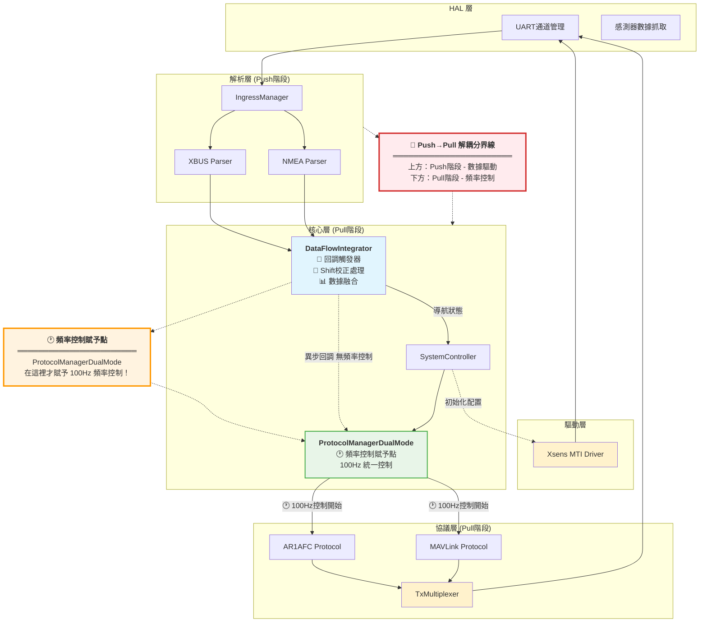
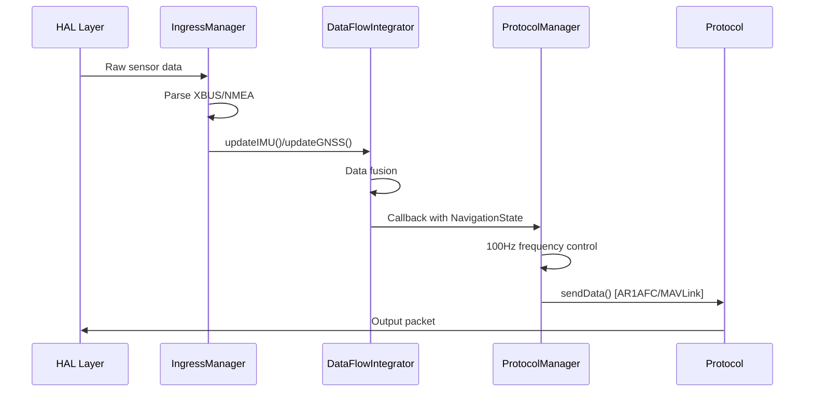

# GMINS 系統架構 - Parser → Adapter → Protocol

> **更新版本**: 2025-01-17  
> **狀態**: 反映當前穩定代碼架構  
> **重點**: 精簡且準確的核心設計說明

## 核心架構概覽

GMINS 是基於 Arduino 的高性能導航系統，採用固定 100Hz 頻率和 Push→Pull 解耦設計。



## 主要組件設計

### 1. HAL 層 (Hardware Abstraction Layer)
**職責**: 硬體抽象與數據抓取
```cpp
// 5個UART通道配置
DEBUG (Serial)     - USB調試輸出
GNSS (Serial4)     - GPS數據輸入  
IMU (Serial2)      - XSENS數據輸入
MAVLINK (Serial1)  - Pixhawk輸出
AUX (Serial3)      - NMEA輸出
```

### 2. 驅動層 (Driver Layer)

#### Xsens MTI Driver
- **職責**: XSENS MTI 設備初始化與配置
- **設計**: 純粹的命令發送器，不處理數據讀取
- **核心功能**:
  ```cpp
  initializeStandardConfiguration()  // 標準初始化流程
  resetHeading()                    // YAW重置為0
  sendCommandSimple()               // XBUS命令發送
  ```
- **初始化序列**:
  1. 配置模式 → 初始化 → 採樣頻率 (100Hz)
  2. 輸出配置 → 測量模式 → 陀螺儀校準 (15秒)
  3. **Heading Reset** → 確保YAW從0開始
- **與系統集成**: SystemController 啟動時執行設備配置

### 3. 解析層 (Parser Layer)
**職責**: 協議解析與數據轉換

- **IngressManager**: 統一管理所有數據來源
- **XBUS Parser**: 解析 XSENS MTI 數據為 IMUData
- **NMEA Parser**: 解析 GPS 數據為 GNSSData

### 4. 核心層 (Core Layer)

#### SystemController
- 系統生命週期管理 (INIT → RUNNING → SHUTDOWN)
- 協議模式動態切換
- **MTI 驅動整合**: 啟動時調用 MTI Driver 進行設備初始化

#### DataFlowIntegrator
- **設計**: Header-only 極簡設計
- **核心功能**: 
  - IMU/GNSS 數據融合與 NavigationState 生成
  - **Shift 校正處理**: 航向偏差校正和應用
  - **數據品質檢查**: 最小品質門檻驗證
- **特色**: Push→Pull 解耦，通過回調避免循環依賴
- **Shift 校正位置**: 🔄 **關鍵轉換點** - 在解耦分界線上進行數據修正

#### ProtocolManagerDualMode
- **🕐 頻率控制賦予點**: **Pull階段頻率控制在這裡才開始！**
- **雙協議支援**: AR1AFC (自定義GUI) 和 MAVLink (Pixhawk)
- **預分配設計**: 協議實例預先創建，避免動態分配
- **簡化切換**: 3步驟協議切換取代複雜序列
- **關鍵機制**: `continuousUpdate()` 以固定100Hz頻率統一控制所有協議發送

### 5. 協議層 (Protocol Layer)

#### AR1AFC Protocol
```cpp
// 52字節固定封包格式
struct AR1AFCPacket {
    uint8_t header[2];      // 0xAA 0x55
    NavigationState data;   // 姿態、位置、速度
    uint16_t checksum;
};
```

#### MAVLink Protocol
```cpp
// 雙封包發送策略
ODOMETRY 封包    - 姿態、位置、速度數據
GPS_INPUT 封包   - GNSS 原始數據
```

#### TxMultiplexer
- 確保同一時間只有一個協議持有傳輸權
- 避免協議間數據衝突

## 核心數據流程



## Push→Pull 解耦設計

**核心概念**: 系統分為兩個獨立階段，避免複雜的調度依賴和頻率衝突。

### 🔄 解耦分界線說明

**上方 (Push階段)**: 數據驅動，完全異步
- **HAL層 + 驅動層 + 解析層 + DFI**: 感測器數據到達時立即處理
- **特徵**: 事件驅動、**無固定頻率**、實時響應
- **頻率**: IMU ~92Hz, GPS ~13.6Hz (依設備而定)
- **重要**: 📍 **DataFlowIntegrator 仍在 Push階段 - 無頻率控制！**

**下方 (Pull階段)**: 頻率控制，統一調度  
- **ProtocolManagerDualMode + 協議層**: 固定 100Hz 頻率統一控制
- **特徵**: 時間驅動、固定週期、穩定輸出
- **頻率**: 統一 100Hz，確保穩定的協議輸出
- **關鍵**: 🕐 **頻率控制在 ProtocolManagerDualMode 才賦予！**

### 解耦機制與數據處理實現

```cpp
// 🔄 解耦關鍵：DataFlowIntegrator 作為分界點
// Push階段: 立即處理數據
XBUS_Parser -> DFI.updateIMU()     // 數據到達立即處理
NMEA_Parser -> DFI.updateGNSS()   // GPS數據立即處理

// 📐 關鍵: Shift校正在解耦分界線上處理
DFI.processIfReady() {
    // 1. 數據融合
    NavigationState nav_state = fusion(imu_data, gnss_data);
    
    // 2. Shift 校正處理 (關鍵步驟!)
    if (NavigationAdapter::applyYawShiftToQuaternion(nav_state_, shift_offset)) {
        NavigationAdapter::updateShiftConfidence(nav_state_, 0.8f);
    }
    
    // 3. 觸發Pull階段
    callback(nav_state);  // 已校正的數據傳遞給協議層
}

// Pull階段: 異步回調 + 頻率控制
DFI -> callback -> PM.updateSnapshot()  // 異步回調更新快照 (已含Shift校正)
PM.continuousUpdate()                   // 100Hz統一控制發送
```

### 解耦優勢

1. **無頻率干擾**: Push階段不影響Pull階段的固定頻率
2. **高響應性**: 感測器數據立即處理，無等待
3. **穩定輸出**: 協議輸出頻率穩定，不受感測器頻率波動影響
4. **系統穩定**: 避免複雜的同步問題和死鎖
5. **📐 數據處理最佳位置**: Shift校正在解耦分界線處理，確保所有輸出協議都使用已校正的數據

## 關鍵設計原則

### 1. 性能優先
- **固定頻率**: 100Hz 統一操作頻率
- **預分配**: 避免動態記憶體分配
- **Header-only**: 關鍵組件使用 inline 實現

### 2. 穩定性保證
- **簡化設計**: 移除複雜的 TDD 監控器
- **錯誤處理**: 完整的錯誤檢測與恢復機制
- **資源管理**: 嚴格的資源獲取與釋放

### 3. 擴展性考量
- **模組化**: 清晰的模組邊界與介面
- **協議無關**: 核心層不依賴特定協議
- **配置靈活**: 支援動態協議切換

## 系統狀態與模式

```cpp
// 系統狀態
enum class SystemState {
    INIT, CALIBRATING, RUNNING, ERROR, SAFE_MODE, SHUTDOWN
};

// 操作模式  
enum class OperationMode {
    NORMAL,      // 完整 IMU+GNSS 融合
    GPS_ONLY,    // 僅 GNSS 定位
    IMU_ONLY,    // 僅 IMU 姿態
    EMERGENCY    // 安全模式
};
```

## 座標系與單位標準

- **姿態**: NED 座標系，內部使用弧度
- **位置**: WGS84 經緯度，高度為橢球高
- **速度**: NED 座標系，單位 m/s
- **時間**: 系統微秒 (μs)，GNSS 另存 GPS 時間

## 協議切換

```cpp
// 串口命令切換
"AR1AFC"   -> switchToAR1AFC()   // 切換到自定義GUI模式
"MAVLINK"  -> switchToMAVLink()  // 切換到Pixhawk模式
"STATUS"   -> getCurrentStatus() // 查詢當前狀態
```

---

**架構特色**: 高性能、高穩定性、易擴展的嵌入式導航系統，專為 Arduino 平台優化。